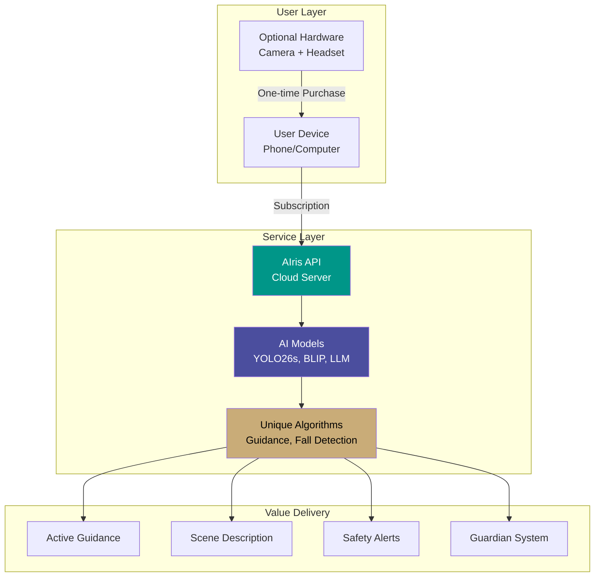

# Business Model

**Core business model and value delivery mechanism for AIris**

---

## 🏗️ Business Model Overview

AIris operates as a **Software-as-a-Service (SaaS)** platform with optional hardware sales, providing AI-powered vision assistance to visually impaired users through cloud-based API access.

### Model Type: **Hybrid SaaS + Hardware**

---

## 💡 Core Value Proposition

### What We Offer

1. **Cloud-Based AI Service**
   - Access to advanced AI models (YOLO26s, BLIP, Groq LLM)
   - Real-time object detection and scene understanding
   - Continuous model updates and improvements
   - No local hardware requirements for AI processing

2. **Unique Proprietary Algorithms**
   - **Active Guidance Algorithm** — Novel approach to object localization
   - **Fall Detection System** — Advanced safety monitoring
   - **Contextual Summarization** — Intelligent scene understanding
   - **Guardian Alert System** — Automated safety notifications

3. **Optional Hardware Bundle**
   - Custom-designed ESP32-CAM with protective casing
   - Bluetooth headset for handsfree operation
   - Professional, durable design
   - Affordable pricing (<3,000 BDT)

4. **Accessibility-First Design**
   - Works with any device (phone, computer, tablet)
   - Handsfree voice control
   - No screen interaction required
   - Affordable pricing for developing markets

---

## 🔄 Business Model Components

### 1. Software Subscription (Primary Revenue)

**How It Works:**
- Users subscribe monthly or annually
- Access AIris API via their device
- All AI processing happens on our servers
- Continuous updates and improvements included

**Value to User:**
- No need for powerful local hardware
- Always up-to-date AI models
- Reliable, scalable service
- Professional support

**Value to Business:**
- Recurring revenue stream
- Predictable cash flow
- Scalable business model
- Customer lifetime value

### 2. Hardware Sales (Secondary Revenue)

**How It Works:**
- One-time purchase of custom hardware bundle
- Optional enhancement for better experience
- Not required for service access
- Bundled with setup support

**Value to User:**
- Professional, custom-designed hardware
- Enhanced handsfree experience
- Wireless camera positioning
- Complete package solution

**Value to Business:**
- Additional revenue stream
- Higher customer lifetime value
- Brand differentiation
- Hardware margin

### 3. Enterprise Licensing (Future Revenue)

**How It Works:**
- Bulk licensing for institutions
- Custom deployment options
- Dedicated support
- Volume discounts

**Value to User:**
- Institutional deployment
- Managed service
- Custom features
- Priority support

**Value to Business:**
- Large contract values
- Stable revenue
- Market expansion
- Partnership opportunities

---

## 🎯 Target Customer Segments

### Segment 1: Individual Users (Primary)

**Characteristics:**
- Visually impaired individuals
- Age 18-65
- Own smartphone or computer
- Internet access
- Monthly income: 15,000-50,000 BDT

**Needs:**
- Daily independence
- Object finding assistance
- Safety monitoring
- Affordable solution

**Value Proposition:**
- Affordable monthly subscription
- Works with existing devices
- Optional hardware for enhanced experience
- Guardian alerts for peace of mind

### Segment 2: Caregivers & Families

**Characteristics:**
- Family members of visually impaired
- Concerned about safety
- Want to help loved ones
- Willing to pay for peace of mind

**Needs:**
- Safety monitoring
- Independence for loved ones
- Easy setup and use
- Reliable service

**Value Proposition:**
- Guardian email alerts
- Fall detection
- Activity summaries
- Easy setup for users

### Segment 3: Institutions (Future)

**Characteristics:**
- Healthcare facilities
- Educational institutions
- Disability organizations
- NGOs

**Needs:**
- Bulk deployment
- Managed service
- Custom features
- Support and training

**Value Proposition:**
- Volume discounts
- Dedicated support
- Custom deployment
- Training programs

---

## 🔗 Key Partnerships

### 1. Hardware Suppliers
- **ESP32-CAM manufacturers** — Bulk procurement
- **Bluetooth headset suppliers** — Quality components
- **3D printing services** — Casing production

### 2. Cloud Infrastructure
- **VPS/Cloud providers** — GPU instances
- **CDN services** — Global content delivery
- **API providers** — Groq, backup services

### 3. Distribution Partners
- **Disability organizations** — User referrals
- **Healthcare providers** — Patient recommendations
- **Retailers** — Hardware distribution

### 4. Technology Partners
- **AI model providers** — Groq, Ultralytics
- **Development tools** — Infrastructure support
- **Payment processors** — Local and international

---

## 🛠️ Key Activities

### 1. Product Development
- AI algorithm refinement
- Feature development
- Model optimization
- Security updates

### 2. Infrastructure Management
- Server maintenance
- API optimization
- Scalability planning
- Monitoring and reliability

### 3. Customer Support
- Technical support
- Setup assistance
- User training
- Community building

### 4. Business Development
- Partnership development
- Market expansion
- Sales and marketing
- Customer acquisition

---

## 📦 Key Resources

### 1. Intellectual Property
- **Proprietary algorithms** — Guidance, fall detection
- **System architecture** — Unique implementation
- **Hardware design** — Custom casing
- **Brand and trademarks** — AIris identity

### 2. Technology Stack
- **AI models** — YOLO26s, BLIP, LLM
- **Infrastructure** — Cloud servers, APIs
- **Software** — Backend, frontend, mobile
- **Hardware** — ESP32-CAM, casing design

### 3. Human Resources
- **Development team** — AI, software, hardware
- **Support team** — Customer service
- **Business team** — Sales, marketing, operations

### 4. Financial Resources
- **Initial capital** — Launch funding
- **Operating capital** — Monthly operations
- **Growth capital** — Scaling investment

---

## 💰 Revenue Streams

### Stream 1: Subscription Revenue (Primary)

**Monthly Subscriptions:**
- Basic: $9.99/month
- Pro: $19.99/month
- Family: $29.99/month

**Annual Subscriptions:**
- 2 months free (16.7% discount)
- Better cash flow
- Lower churn

**Projected Contribution:** 70-80% of total revenue

### Stream 2: Hardware Sales (Secondary)

**Hardware Bundle:**
- ESP32-CAM with casing: $12.99
- Bluetooth headset: $13.99
- Complete bundle: $24.99

**Projected Contribution:** 15-20% of total revenue

### Stream 3: Enterprise Licensing (Future)

**Institutional Plans:**
- Volume discounts
- Custom pricing
- Dedicated support

**Projected Contribution:** 10-15% of total revenue (Year 2+)

---

## 💸 Cost Structure

### Fixed Costs

| Cost Category | Monthly (USD) | Annual (USD) |
|:-------------|:------------:|:------------:|
| **Cloud Infrastructure** | $200-500 | $2,400-6,000 |
| **API Costs (Groq)** | $100-300 | $1,200-3,600 |
| **Development Team** | $2,000-5,000 | $24,000-60,000 |
| **Support Team** | $500-1,500 | $6,000-18,000 |
| **Marketing** | $500-2,000 | $6,000-24,000 |
| **Operations** | $200-500 | $2,400-6,000 |
| **Total Fixed** | **$3,500-9,800** | **$42,000-117,600** |

### Variable Costs

| Cost Category | Per User/Month | Per Transaction |
|:-------------|:--------------:|:---------------:|
| **API Inference** | $0.50-1.50 | - |
| **Storage** | $0.10-0.30 | - |
| **Bandwidth** | $0.20-0.50 | - |
| **Hardware COGS** | - | $15-18 |
| **Payment Processing** | - | 2.9% + $0.30 |

### Break-Even Analysis

**Monthly Break-Even:**
- Fixed costs: $3,500-9,800
- Average revenue per user: $15-20
- Variable cost per user: $0.80-2.30
- **Break-even users: 200-500** (depending on tier mix)

---

## 🎯 Competitive Advantages

### 1. Unique Algorithms
- **Active Guidance** — Not just description, but active help
- **Fall Detection** — Advanced safety monitoring
- **Contextual Understanding** — Intelligent scene analysis

### 2. Affordable Pricing
- **Accessible for developing markets**
- **Transparent pricing**
- **No hidden fees**

### 3. Complete Solution
- **Software + Optional Hardware**
- **Guardian system included**
- **Handsfree operation**

### 4. Local Market Understanding
- **Bangladesh-based team**
- **Cultural sensitivity**
- **Local language support (future)**

---

## 📊 Unit Economics

### Customer Acquisition Cost (CAC)

| Channel | CAC (USD) | CAC (BDT) |
|:--------|:---------:|:---------:|
| **Organic/Social** | $10-30 | ৳1,100-3,300 |
| **Paid Ads** | $30-50 | ৳3,300-5,500 |
| **Partnerships** | $20-40 | ৳2,200-4,400 |
| **Average** | **$25** | **৳2,750** |

### Lifetime Value (LTV)

**Assumptions:**
- Average subscription: $15/month
- Average lifetime: 24 months
- Hardware purchase: 30% attach rate, $25
- Churn rate: 5% monthly

**Calculation:**
- Subscription LTV: $15 × 24 = $360
- Hardware contribution: $25 × 0.3 = $7.50
- **Total LTV: $367.50**

**LTV:CAC Ratio: 14.7:1** ✅ (Target: >3:1)

### Payback Period

- CAC: $25
- Monthly margin: $12-15
- **Payback: 1.7-2.1 months** ✅ (Target: <12 months)

---

## 🚀 Growth Strategy

### Phase 1: Foundation (Months 1-6)
- **Goal:** 100-500 paying users
- **Focus:** Product-market fit, pricing validation
- **Revenue Target:** $1,500-7,500/month

### Phase 2: Growth (Months 7-18)
- **Goal:** 1,000-5,000 paying users
- **Focus:** Market expansion, partnerships
- **Revenue Target:** $15,000-100,000/month

### Phase 3: Scale (Months 19+)
- **Goal:** 10,000+ paying users
- **Focus:** International expansion, enterprise
- **Revenue Target:** $150,000+/month

---

## 🎓 Social Impact Considerations

### Accessibility Pricing
- **Free tier consideration** for extreme need cases
- **NGO partnerships** for subsidized access
- **Educational discounts** for students
- **Government programs** for public health

### Ethical Business Practices
- **Transparent pricing** — No hidden fees
- **Data privacy** — User data protection
- **Fair treatment** — Equal access regardless of ability to pay
- **Community support** — User forums and assistance

---

## 📈 Success Metrics

### Financial Metrics
- **Monthly Recurring Revenue (MRR)**
- **Annual Recurring Revenue (ARR)**
- **Customer Lifetime Value (LTV)**
- **Customer Acquisition Cost (CAC)**
- **Gross Margin**
- **Net Revenue Retention**

### Product Metrics
- **Active Users**
- **Daily/Monthly Active Users**
- **Feature Adoption**
- **User Satisfaction (NPS)**
- **Churn Rate**

### Business Metrics
- **Market Share**
- **Brand Awareness**
- **Partnership Count**
- **Customer Support Quality**

---

**A sustainable business model that serves the visually impaired community**

*Next: [Pricing Strategy](./02-Pricing-Strategy.md)*

