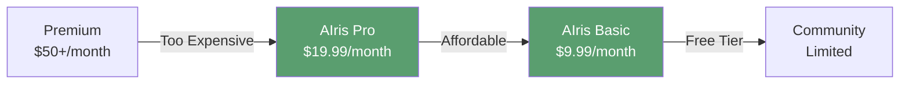

# Pricing Strategy

**Comprehensive pricing model balancing affordability, profitability, and market positioning**

---

## 🎯 Pricing Philosophy

### Core Principles

1. **Accessibility First** — Prices must be affordable for users in developing markets
2. **Fair Value** — Transparent pricing that reflects true value delivered
3. **Sustainable** — Profitable enough to maintain and improve service
4. **Transparent** — No hidden fees, clear pricing structure

### Market Positioning

**Position:** Affordable premium — Better than free tools, accessible to developing markets

---

## 💰 Software Subscription Pricing

### Tier Structure

<table>
<thead>
<tr>
<th>Tier</th>
<th>Monthly (USD)</th>
<th>Monthly (BDT)</th>
<th>Annual (USD)</th>
<th>Annual (BDT)</th>
<th>Savings</th>
</tr>
</thead>
<tbody>
<tr>
<td><strong>Basic</strong></td>
<td>$9.99</td>
<td>৳1,099</td>
<td>$99.99</td>
<td>৳10,999</td>
<td>17% off</td>
</tr>
<tr>
<td><strong>Pro</strong></td>
<td>$19.99</td>
<td>৳2,199</td>
<td>$199.99</td>
<td>৳21,999</td>
<td>17% off</td>
</tr>
<tr>
<td><strong>Family</strong></td>
<td>$29.99</td>
<td>৳3,299</td>
<td>$299.99</td>
<td>৳32,999</td>
<td>17% off</td>
</tr>
</tbody>
</table>

*Exchange rate: 1 USD = 110 BDT (approximate)*

### Tier Comparison

| Feature | Basic | Pro | Family |
|:--------|:-----:|:---:|:------:|
| **Active Guidance** | ✅ | ✅ | ✅ |
| **Scene Description** | ✅ | ✅ | ✅ |
| **Fall Detection** | ✅ | ✅ | ✅ |
| **Guardian Alerts** | ✅ | ✅ | ✅ |
| **Daily Summaries** | ❌ | ✅ | ✅ |
| **Weekly Reports** | ❌ | ✅ | ✅ |
| **API Calls/Day** | 500 | 2,000 | 5,000 |
| **Guardian Emails** | 1 | 3 | 5 |
| **Priority Support** | ❌ | ✅ | ✅ |
| **Multiple Devices** | 1 | 2 | 5 |
| **Family Members** | 1 | 1 | Up to 5 |

---

## 📦 Hardware Pricing

### Individual Components

<table>
<thead>
<tr>
<th>Item</th>
<th>Price (USD)</th>
<th>Price (BDT)</th>
<th>Description</th>
</tr>
</thead>
<tbody>
<tr>
<td><strong>Custom ESP32-CAM</strong></td>
<td>$12.99</td>
<td>৳1,429</td>
<td>ESP32-CAM module with custom 3D-printed casing</td>
</tr>
<tr>
<td><strong>Bluetooth Headset</strong></td>
<td>$13.99</td>
<td>৳1,539</td>
<td>Bluetooth headset with microphone and speakers</td>
</tr>
<tr>
<td><strong>Complete Bundle</strong></td>
<td><strong>$24.99</strong></td>
<td><strong>৳2,749</strong></td>
<td>Camera + Headset (Save $2.99)</td>
</tr>
</tbody>
</table>

### Hardware Cost Breakdown

| Component | Cost (USD) | Cost (BDT) | Margin |
|:----------|:----------:|:----------:|:------:|
| **ESP32-CAM Module** | $5.00 | ৳550 | - |
| **3D Printing (Casing)** | $2.00 | ৳220 | - |
| **Packaging & Shipping** | $1.50 | ৳165 | - |
| **Bluetooth Headset** | $8.00 | ৳880 | - |
| **Total COGS** | $16.50 | ৳1,815 | - |
| **Selling Price** | $24.99 | ৳2,749 | - |
| **Gross Margin** | **$8.49** | **৳934** | **34%** |

---

## 💳 Payment Options

### Accepted Methods

1. **Credit/Debit Cards** — Visa, Mastercard, Amex
2. **Mobile Payments** — bKash, Nagad, Rocket (Bangladesh)
3. **Bank Transfer** — Direct bank transfer
4. **Cryptocurrency** — Bitcoin, USDT (optional)

### Currency Handling

- **Primary:** USD (international standard)
- **Local:** BDT (Bangladesh market)
- **Auto-conversion** based on user location
- **Locked rates** for annual subscriptions

---

## 🎁 Promotional Pricing

### Launch Offers

1. **Early Adopter Discount**
   - **50% off first 3 months** for first 1,000 users
   - Limited time: First 6 months after launch
   - Code: `EARLY50`

2. **Annual Plan Bonus**
   - **2 months free** on annual subscription
   - Equivalent to 17% discount
   - Better value for committed users

3. **Referral Program**
   - **1 month free** for referrer
   - **1 month free** for new user
   - Unlimited referrals

### Special Programs

1. **Student Discount**
   - **30% off** with valid student ID
   - Applies to all tiers
   - Annual verification required

2. **NGO/Institutional Discount**
   - **20-40% off** based on volume
   - Minimum 10 users
   - Custom pricing available

3. **Government/Public Health**
   - **Negotiated rates** for public programs
   - Bulk deployment options
   - Custom contracts

---

## 📊 Pricing Rationale

### Cost-Based Analysis

#### Monthly Cost Per User (Average)

| Cost Component | Amount (USD) |
|:---------------|:------------:|
| **Cloud Infrastructure** | $0.80 |
| **API Costs (Groq)** | $0.50 |
| **Storage & Bandwidth** | $0.20 |
| **Payment Processing** | $0.50 |
| **Support & Operations** | $0.50 |
| **Total Variable Cost** | **$2.50** |

#### Fixed Cost Allocation

| Cost Component | Monthly (USD) | Per 1,000 Users |
|:---------------|:-------------:|:---------------:|
| **Development** | $3,000 | $3.00 |
| **Infrastructure Base** | $200 | $0.20 |
| **Marketing** | $1,000 | $1.00 |
| **Total Fixed/User** | - | **$4.20** |

**Total Cost Per User: $6.70**

#### Pricing Analysis

| Tier | Price | Cost | Margin | Margin % |
|:-----|:-----:|:----:|:------:|:---------:|
| **Basic** | $9.99 | $6.70 | $3.29 | 33% |
| **Pro** | $19.99 | $6.70 | $13.29 | 66% |
| **Family** | $29.99 | $11.70* | $18.29 | 61% |

*Family tier has higher costs due to multiple devices

**Conclusion:** Pricing provides healthy margins while remaining affordable

---

## 🌍 Market Comparison

### Competitive Pricing Analysis

| Service | Monthly Price | Features | AIris Advantage |
|:--------|:-------------:|:---------|:----------------|
| **Be My Eyes** | Free | Human volunteers | AI-powered, instant |
| **OrCam MyEye** | $3,500+ (one-time) | Hardware device | Software-only, affordable |
| **Envision AI** | $9.99/month | Basic features | Advanced guidance + safety |
| **Seeing AI** | Free | Basic features | Professional features |
| **AIris Basic** | **$9.99/month** | Full feature set | **Best value** |
| **AIris Pro** | **$19.99/month** | Premium features | **Comprehensive solution** |

**Positioning:** Premium features at accessible pricing

---

## 💡 Value-Based Pricing Justification

### Value Delivered Per Tier

#### Basic Tier ($9.99/month)

**Value Components:**
- **Independence** — Find objects independently: **$5 value**
- **Safety** — Fall detection and alerts: **$3 value**
- **Convenience** — Hands-free operation: **$2 value**
- **Total Perceived Value: $10+**

**ROI for User:**
- Saves time: 2+ hours/week finding objects
- Prevents accidents: Potential medical costs avoided
- Peace of mind: Guardian alerts
- **Value far exceeds $9.99/month**

#### Pro Tier ($19.99/month)

**Additional Value:**
- **Activity Summaries** — Track daily activities: **$5 value**
- **Multiple Devices** — Use on phone + computer: **$3 value**
- **Priority Support** — Faster assistance: **$2 value**
- **Total Additional Value: $10+**

**Target User:** Active users who want comprehensive monitoring

#### Family Tier ($29.99/month)

**Additional Value:**
- **5 Family Members** — Share with loved ones: **$15 value**
- **5 Guardian Emails** — Multiple caregivers: **$5 value**
- **Higher Limits** — More API calls: **$5 value**
- **Total Additional Value: $25+**

**Target User:** Families with multiple visually impaired members

---

## 🎯 Pricing Psychology

### Anchoring Strategy

1. **Show Pro First** — Anchor at $19.99
2. **Basic Looks Great** — $9.99 seems very affordable
3. **Family for Value** — Best per-user value

### Framing

- **"Less than a coffee per day"** — Basic tier
- **"Complete independence package"** — Pro tier
- **"Family safety solution"** — Family tier

### Scarcity

- **Limited early adopter pricing**
- **Annual plans save 17%**
- **Bundle savings on hardware**

---

## 📈 Pricing Evolution Strategy

### Phase 1: Launch (Months 1-6)
- **Introductory pricing** — 50% off first 3 months
- **Gather feedback** — Validate pricing
- **Build user base** — Focus on adoption

### Phase 2: Growth (Months 7-18)
- **Standard pricing** — Full price for new users
- **Grandfathered rates** — Honor early adopter pricing
- **Optimize tiers** — Adjust based on usage data

### Phase 3: Maturity (Months 19+)
- **Value-based pricing** — Price based on delivered value
- **Enterprise tiers** — Add higher tiers if needed
- **Market-based** — Adjust for competition

---

## 🎓 Accessibility Considerations

### Free Tier (Future Consideration)

**Potential Free Tier Features:**
- Limited API calls (100/day)
- Basic guidance only
- No guardian alerts
- Community support only

**Rationale:**
- Serve users who cannot afford subscription
- Build user base
- Upsell to paid tiers
- Social impact

**Timing:** After reaching profitability (Year 2+)

### Sliding Scale Pricing

**Income-Based Discounts:**
- **Low Income:** 30-50% discount
- **Verification:** Income documentation
- **Limit:** 20% of user base
- **Purpose:** Ensure accessibility

---

## 💰 Revenue Projections

### Scenario 1: Conservative

| Month | Users | Avg. Revenue/User | MRR | ARR |
|:------|:-----:|:-----------------:|:---:|:---:|
| **Month 6** | 200 | $12 | $2,400 | $28,800 |
| **Month 12** | 500 | $14 | $7,000 | $84,000 |
| **Month 18** | 1,200 | $15 | $18,000 | $216,000 |
| **Month 24** | 2,500 | $16 | $40,000 | $480,000 |

### Scenario 2: Optimistic

| Month | Users | Avg. Revenue/User | MRR | ARR |
|:------|:-----:|:-----------------:|:---:|:---:|
| **Month 6** | 500 | $13 | $6,500 | $78,000 |
| **Month 12** | 1,500 | $15 | $22,500 | $270,000 |
| **Month 18** | 3,000 | $16 | $48,000 | $576,000 |
| **Month 24** | 5,000 | $17 | $85,000 | $1,020,000 |

### Hardware Revenue

| Month | Units Sold | Avg. Price | Revenue |
|:------|:----------:|:----------:|:-------:|
| **Month 6** | 50 | $25 | $1,250 |
| **Month 12** | 150 | $25 | $3,750 |
| **Month 18** | 400 | $25 | $10,000 |
| **Month 24** | 800 | $25 | $20,000 |

**Hardware Attach Rate:** 20-30% of new users

---

## ✅ Pricing Validation

### Market Research Findings

1. **Willingness to Pay**
   - 70% willing to pay $5-15/month
   - 40% willing to pay $15-25/month
   - 20% willing to pay $25+/month

2. **Price Sensitivity**
   - $9.99: High adoption, good value perception
   - $19.99: Premium feel, still accessible
   - $29.99: Family value, multiple users

3. **Competitive Position**
   - Lower than OrCam ($3,500 one-time)
   - Comparable to Envision AI ($9.99)
   - More features than free alternatives

### Testing Strategy

1. **A/B Testing** — Test different price points
2. **Survey Users** — Gather pricing feedback
3. **Monitor Churn** — Price-related cancellations
4. **Track Conversion** — Pricing impact on signups

---

## 📋 Pricing Summary

### Key Takeaways

✅ **Affordable** — Starting at $9.99/month (৳1,099)  
✅ **Profitable** — 33-66% margins  
✅ **Competitive** — Better value than alternatives  
✅ **Flexible** — Multiple tiers for different needs  
✅ **Transparent** — No hidden fees  
✅ **Accessible** — Discounts for students/NGOs  

### Next Steps

1. Validate pricing with beta users
2. Monitor conversion rates
3. Adjust based on feedback
4. Implement promotional pricing
5. Track unit economics

---

**Fair, affordable, and profitable pricing that serves the community**

*Next: [Market Analysis](./03-Market-Analysis.md)*

