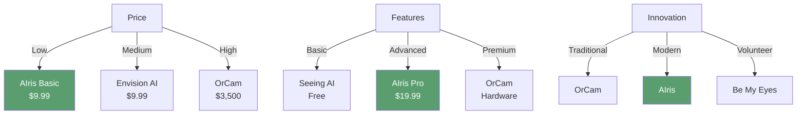

# Market Analysis

**Comprehensive market research and opportunity analysis**

---

## 🌍 Market Overview

### Global Assistive Technology Market

**Market Size:**
- **2024:** $27 billion globally
- **2025-2030 CAGR:** 7.2%
- **2030 Projected:** $42 billion

**Key Segments:**
- Vision assistance: $3.5 billion (2024)
- Mobility aids: $8.2 billion
- Hearing aids: $10.1 billion
- Communication devices: $5.2 billion

### Vision Assistance Sub-Market

**Market Characteristics:**
- **Growth Rate:** 8.5% CAGR (2024-2030)
- **Key Drivers:**
  - Aging population
  - AI/ML advancements
  - Smartphone penetration
  - Accessibility awareness

**Market Players:**
- OrCam Technologies: $40M+ revenue (2024)
- Envision AI: Growing SaaS model
- Be My Eyes: Free volunteer model
- Seeing AI: Microsoft (free)

---

## 🇧🇩 Bangladesh Market

### Demographics

| Metric | Value | Source |
|:-------|:-----:|:-------|
| **Total Population** | 170M | World Bank 2024 |
| **Visually Impaired** | 2.5M+ | WHO estimates |
| **Blind (Legal)** | 750K+ | National statistics |
| **Smartphone Penetration** | 45% | GSMA 2024 |
| **Internet Users** | 120M+ | BTRC 2024 |
| **Urban Population** | 40% | World Bank |

### Economic Indicators

| Metric | Value |
|:-------|:-----:|
| **GDP Per Capita** | $2,800 (2024) |
| **Average Monthly Income** | $200-400 |
| **Disposable Income** | $50-150/month |
| **Tech Adoption** | High (mobile-first) |

### Market Opportunity

**Total Addressable Market (TAM):**
- Visually impaired: 2.5M
- With smartphone/computer: ~500K (20%)
- **TAM: 500,000 potential users**

**Serviceable Addressable Market (SAM):**
- Active internet users: ~300K
- Can afford $10-20/month: ~150K
- **SAM: 150,000 potential users**

**Serviceable Obtainable Market (SOM):**
- Year 1 target: 500-1,000 users (0.3-0.7% of SAM)
- Year 2 target: 2,000-5,000 users (1.3-3.3% of SAM)
- Year 3 target: 10,000+ users (6.7%+ of SAM)

---

## 🎯 Target Customer Segments

### Segment 1: Primary Users (60% of market)

**Profile:**
- Age: 25-55
- Income: $200-500/month
- Education: Secondary to tertiary
- Tech-savvy: Moderate to high
- Location: Urban and semi-urban

**Needs:**
- Daily independence
- Object finding
- Safety monitoring
- Affordable solution

**Size:** ~90,000 users

### Segment 2: Caregivers (25% of market)

**Profile:**
- Family members
- Age: 30-60
- Income: $300-600/month
- Concern: Loved one's safety

**Needs:**
- Peace of mind
- Safety alerts
- Easy setup
- Reliable service

**Size:** ~37,500 users

### Segment 3: Institutions (15% of market)

**Profile:**
- Healthcare facilities
- Educational institutions
- NGOs
- Government programs

**Needs:**
- Bulk deployment
- Managed service
- Training support
- Custom features

**Size:** ~22,500 users (potential)

---

## 🔍 Competitive Analysis

### Direct Competitors

<table>
<thead>
<tr>
<th>Competitor</th>
<th>Model</th>
<th>Price</th>
<th>Strengths</th>
<th>Weaknesses</th>
</tr>
</thead>
<tbody>
<tr>
<td><strong>OrCam MyEye</strong></td>
<td>Hardware</td>
<td>$3,500+</td>
<td>Established brand, quality</td>
<td>Expensive, hardware required</td>
</tr>
<tr>
<td><strong>Envision AI</strong></td>
<td>SaaS</td>
<td>$9.99/month</td>
<td>Affordable, good features</td>
<td>Limited guidance, no fall detection</td>
</tr>
<tr>
<td><strong>Be My Eyes</strong></td>
<td>Free/Volunteer</td>
<td>Free</td>
<td>Free, human help</td>
<td>Not instant, requires volunteers</td>
</tr>
<tr>
<td><strong>Seeing AI</strong></td>
<td>Free App</td>
<td>Free</td>
<td>Free, Microsoft backing</td>
<td>Basic features, no guidance</td>
</tr>
<tr>
<td><strong>AIris</strong></td>
<td>SaaS + Hardware</td>
<td>$9.99-29.99/month</td>
<td><strong>Active guidance, fall detection, guardian alerts</strong></td>
<td>New brand, needs awareness</td>
</tr>
</tbody>
</table>

### Competitive Positioning

**AIris Position:** Best value — Advanced features at accessible pricing

---

## 💡 Market Gaps & Opportunities

### Gap 1: Active Guidance

**Current State:**
- Most solutions only describe scenes
- Limited active help finding objects
- No hand tracking integration

**Opportunity:**
- AIris's unique guidance algorithm
- Real-time object localization
- Step-by-step instructions

### Gap 2: Safety Monitoring

**Current State:**
- No fall detection in consumer apps
- Limited guardian alert systems
- Reactive rather than proactive

**Opportunity:**
- AIris's fall detection algorithm
- Automated guardian emails
- Daily/weekly summaries

### Gap 3: Affordability in Developing Markets

**Current State:**
- Premium solutions too expensive
- Free solutions lack features
- No middle ground

**Opportunity:**
- AIris's affordable pricing
- Tiered subscription model
- Optional hardware bundle

### Gap 4: Complete Solution

**Current State:**
- Software OR hardware, not both
- Fragmented solutions
- Complex setup

**Opportunity:**
- AIris's integrated approach
- Software + optional hardware
- Easy setup and use

---

## 📊 Market Trends

### Trend 1: AI Advancement

**Impact:**
- Better object detection
- Improved scene understanding
- Lower costs

**AIris Advantage:**
- Using latest models (YOLO26s)
- Continuous updates
- Cost-effective inference (Groq)

### Trend 2: SaaS Adoption

**Impact:**
- Subscription model acceptance
- Cloud-based services
- Mobile-first approach

**AIris Advantage:**
- Native SaaS model
- Works on any device
- No hardware requirement

### Trend 3: Accessibility Awareness

**Impact:**
- Government initiatives
- Corporate social responsibility
- NGO partnerships

**AIris Advantage:**
- Social impact focus
- Partnership opportunities
- Government program potential

### Trend 4: Aging Population

**Impact:**
- More visually impaired users
- Increased demand
- Healthcare integration

**AIris Advantage:**
- Safety features
- Guardian system
- Healthcare partnerships

---

## 🎯 Market Entry Strategy

### Phase 1: Local Market (Bangladesh)

**Focus:**
- Urban areas (Dhaka, Chittagong)
- Tech-savvy users
- Early adopters

**Timeline:** Months 1-12

**Target:** 500-2,000 users

### Phase 2: Regional Expansion

**Focus:**
- South Asia (India, Pakistan, Sri Lanka)
- Similar market characteristics
- Cultural similarities

**Timeline:** Months 13-24

**Target:** 5,000-10,000 users

### Phase 3: Global Expansion

**Focus:**
- Developed markets (US, EU)
- Premium pricing
- Enterprise focus

**Timeline:** Months 25+

**Target:** 10,000+ users

---

## 📈 Market Size Projections

### Bangladesh Market

| Year | Users | Revenue (USD) | Revenue (BDT) |
|:-----|:-----:|:-------------:|:-------------:|
| **Year 1** | 1,000 | $180,000 | ৳19,800,000 |
| **Year 2** | 5,000 | $900,000 | ৳99,000,000 |
| **Year 3** | 10,000 | $1,800,000 | ৳198,000,000 |

### Regional Market (South Asia)

| Year | Users | Revenue (USD) |
|:-----|:-----:|:-------------:|
| **Year 2** | 10,000 | $1,800,000 |
| **Year 3** | 25,000 | $4,500,000 |
| **Year 5** | 50,000 | $9,000,000 |

---

## 🚧 Market Challenges

### Challenge 1: Low Awareness

**Issue:** Limited awareness of assistive technology

**Solution:**
- Educational campaigns
- Partnership with disability organizations
- Government advocacy

### Challenge 2: Affordability Concerns

**Issue:** Users may find even $9.99/month expensive

**Solution:**
- Sliding scale pricing
- NGO partnerships
- Government subsidies
- Free tier (future)

### Challenge 3: Technology Adoption

**Issue:** Some users not tech-savvy

**Solution:**
- Easy setup process
- Comprehensive support
- Training programs
- Simple interface

### Challenge 4: Infrastructure

**Issue:** Internet reliability in some areas

**Solution:**
- Offline capabilities (future)
- Low bandwidth optimization
- Mobile data optimization

---

## ✅ Market Validation

### Validation Methods

1. **User Surveys**
   - Willingness to pay
   - Feature preferences
   - Price sensitivity

2. **Beta Testing**
   - Real user feedback
   - Usage patterns
   - Pain points

3. **Partnership Discussions**
   - NGO interest
   - Healthcare adoption
   - Government programs

4. **Competitive Analysis**
   - Market gaps
   - Pricing validation
   - Feature comparison

---

## 🎯 Market Opportunity Summary

### Key Insights

✅ **Large Market** — 2.5M+ visually impaired in Bangladesh  
✅ **Growing Demand** — 8.5% CAGR in vision assistance  
✅ **Market Gaps** — Active guidance, safety monitoring  
✅ **Affordable Pricing** — Accessible to developing markets  
✅ **Unique Features** — Competitive advantages  
✅ **Social Impact** — Meaningful business opportunity  

### Success Factors

1. **Product-Market Fit** — Solving real problems
2. **Affordable Pricing** — Accessible to target market
3. **Unique Features** — Competitive differentiation
4. **Strong Support** — User success focus
5. **Partnerships** — Distribution and advocacy

---

**A large, growing market with significant opportunity for impact**

*Next: [Financial Model](./04-Financial-Model.md)*

