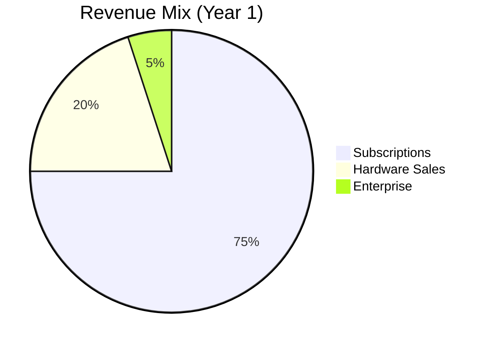
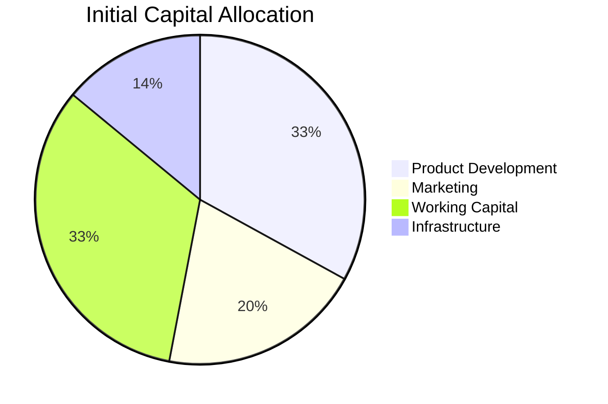

# Financial Model

**Comprehensive financial projections and unit economics**

---

## 💰 Cost Structure

### Fixed Costs (Monthly)

<table>
<thead>
<tr>
<th>Category</th>
<th>Low (USD)</th>
<th>High (USD)</th>
<th>Notes</th>
</tr>
</thead>
<tbody>
<tr>
<td><strong>Cloud Infrastructure</strong></td>
<td>$200</td>
<td>$500</td>
<td>VPS with GPU, scales with users</td>
</tr>
<tr>
<td><strong>API Costs (Groq)</strong></td>
<td>$100</td>
<td>$300</td>
<td>Free tier + paid for scale</td>
</tr>
<tr>
<td><strong>Development Team</strong></td>
<td>$2,000</td>
<td>$5,000</td>
<td>2-3 developers part-time</td>
</tr>
<tr>
<td><strong>Support Team</strong></td>
<td>$500</td>
<td>$1,500</td>
<td>Customer service</td>
</tr>
<tr>
<td><strong>Marketing</strong></td>
<td>$500</td>
<td>$2,000</td>
<td>Ads, content, partnerships</td>
</tr>
<tr>
<td><strong>Operations</strong></td>
<td>$200</td>
<td>$500</td>
<td>Tools, software, admin</td>
</tr>
<tr>
<td><strong>Total Fixed</strong></td>
<td><strong>$3,500</strong></td>
<td><strong>$9,800</strong></td>
<td>Scales with growth</td>
</tr>
</tbody>
</table>

### Variable Costs (Per User/Month)

| Cost Component | Amount (USD) | Notes |
|:---------------|:------------:|:------|
| **API Inference** | $0.50-1.50 | Depends on usage tier |
| **Storage** | $0.10-0.30 | User data, logs |
| **Bandwidth** | $0.20-0.50 | Video streaming, API calls |
| **Payment Processing** | $0.29-0.58 | 2.9% + $0.30 per transaction |
| **Support** | $0.20-0.50 | Average support time |
| **Total Variable** | **$1.29-3.38** | Average: $2.50/user/month |

### Hardware Costs (Per Unit)

| Component | Cost (USD) | Cost (BDT) |
|:----------|:----------:|:----------:|
| **ESP32-CAM Module** | $5.00 | ৳550 |
| **3D Printing (Casing)** | $2.00 | ৳220 |
| **Bluetooth Headset** | $8.00 | ৳880 |
| **Packaging** | $0.50 | ৳55 |
| **Shipping (Local)** | $1.00 | ৳110 |
| **Total COGS** | **$16.50** | **৳1,815** |
| **Selling Price** | $24.99 | ৳2,749 |
| **Gross Margin** | **$8.49 (34%)** | **৳934** |

---

## 📊 Revenue Model

### Revenue Streams

### Subscription Revenue Projections

#### Scenario 1: Conservative

| Month | Users | Avg. Price | MRR | ARR |
|:------|:-----:|:----------:|:---:|:---:|
| **3** | 50 | $12 | $600 | $7,200 |
| **6** | 200 | $12 | $2,400 | $28,800 |
| **12** | 500 | $14 | $7,000 | $84,000 |
| **18** | 1,200 | $15 | $18,000 | $216,000 |
| **24** | 2,500 | $16 | $40,000 | $480,000 |

#### Scenario 2: Optimistic

| Month | Users | Avg. Price | MRR | ARR |
|:------|:-----:|:----------:|:---:|:---:|
| **3** | 150 | $13 | $1,950 | $23,400 |
| **6** | 500 | $13 | $6,500 | $78,000 |
| **12** | 1,500 | $15 | $22,500 | $270,000 |
| **18** | 3,000 | $16 | $48,000 | $576,000 |
| **24** | 5,000 | $17 | $85,000 | $1,020,000 |

### Hardware Revenue

| Month | Units Sold | Price | Revenue |
|:------|:----------:|:-----:|:-------:|
| **3** | 10 | $25 | $250 |
| **6** | 50 | $25 | $1,250 |
| **12** | 150 | $25 | $3,750 |
| **18** | 400 | $25 | $10,000 |
| **24** | 800 | $25 | $20,000 |

**Attach Rate:** 20-30% of new users

---

## 💵 Unit Economics

### Customer Acquisition Cost (CAC)

| Channel | CAC (USD) | Notes |
|:--------|:---------:|:------|
| **Organic/Social** | $10-30 | Content, SEO, referrals |
| **Paid Ads** | $30-50 | Google, Facebook ads |
| **Partnerships** | $20-40 | NGO, healthcare referrals |
| **Average CAC** | **$25** | Blended average |

### Lifetime Value (LTV)

**Assumptions:**
- Average subscription: $15/month
- Average lifetime: 24 months
- Churn rate: 5% monthly
- Hardware attach: 30%, $25

**Calculation:**
- Subscription LTV: $15 × 20 months* = $300
- Hardware contribution: $25 × 0.3 = $7.50
- **Total LTV: $307.50**

*Adjusted for 5% monthly churn

**LTV:CAC Ratio: 12.3:1** ✅ (Target: >3:1)

### Payback Period

- CAC: $25
- Monthly margin: $12.50 (after variable costs)
- **Payback: 2 months** ✅ (Target: <12 months)

---

## 📈 Financial Projections

### Year 1: Foundation

<table>
<thead>
<tr>
<th>Metric</th>
<th>Q1</th>
<th>Q2</th>
<th>Q3</th>
<th>Q4</th>
<th>Total</th>
</tr>
</thead>
<tbody>
<tr>
<td><strong>Users (End)</strong></td>
<td>100</td>
<td>300</td>
<td>600</td>
<td>1,000</td>
<td>1,000</td>
</tr>
<tr>
<td><strong>MRR (End)</strong></td>
<td>$1,200</td>
<td>$3,600</td>
<td>$7,200</td>
<td>$12,000</td>
<td>$12,000</td>
</tr>
<tr>
<td><strong>Quarterly Revenue</strong></td>
<td>$3,000</td>
<td>$9,000</td>
<td>$18,000</td>
<td>$30,000</td>
<td>$60,000</td>
</tr>
<tr>
<td><strong>Hardware Revenue</strong></td>
<td>$500</td>
<td>$1,500</td>
<td>$3,000</td>
<td>$5,000</td>
<td>$10,000</td>
</tr>
<tr>
<td><strong>Total Revenue</strong></td>
<td>$3,500</td>
<td>$10,500</td>
<td>$21,000</td>
<td>$35,000</td>
<td>$70,000</td>
</tr>
<tr>
<td><strong>Fixed Costs</strong></td>
<td>$10,500</td>
<td>$12,000</td>
<td>$13,500</td>
<td>$15,000</td>
<td>$51,000</td>
</tr>
<tr>
<td><strong>Variable Costs</strong></td>
<td>$300</td>
<td>$900</td>
<td>$1,800</td>
<td>$3,000</td>
<td>$6,000</td>
</tr>
<tr>
<td><strong>Total Costs</strong></td>
<td>$10,800</td>
<td>$12,900</td>
<td>$15,300</td>
<td>$18,000</td>
<td>$57,000</td>
</tr>
<tr>
<td><strong>Net Income</strong></td>
<td>-$7,300</td>
<td>-$2,400</td>
<td>$5,700</td>
<td>$17,000</td>
<td>$13,000</td>
</tr>
</tbody>
</table>

**Year 1 Summary:**
- **Revenue:** $70,000
- **Costs:** $57,000
- **Net Income:** $13,000
- **Break-even:** Month 9

### Year 2: Growth

<table>
<thead>
<tr>
<th>Metric</th>
<th>Q1</th>
<th>Q2</th>
<th>Q3</th>
<th>Q4</th>
<th>Total</th>
</tr>
</thead>
<tbody>
<tr>
<td><strong>Users (End)</strong></td>
<td>1,500</td>
<td>2,500</td>
<td>3,500</td>
<td>5,000</td>
<td>5,000</td>
</tr>
<tr>
<td><strong>MRR (End)</strong></td>
<td>$22,500</td>
<td>$37,500</td>
<td>$52,500</td>
<td>$75,000</td>
<td>$75,000</td>
</tr>
<tr>
<td><strong>Quarterly Revenue</strong></td>
<td>$45,000</td>
<td>$75,000</td>
<td>$105,000</td>
<td>$150,000</td>
<td>$375,000</td>
</tr>
<tr>
<td><strong>Hardware Revenue</strong></td>
<td>$7,500</td>
<td>$12,500</td>
<td>$17,500</td>
<td>$25,000</td>
<td>$62,500</td>
</tr>
<tr>
<td><strong>Total Revenue</strong></td>
<td>$52,500</td>
<td>$87,500</td>
<td>$122,500</td>
<td>$175,000</td>
<td>$437,500</td>
</tr>
<tr>
<td><strong>Fixed Costs</strong></td>
<td>$18,000</td>
<td>$20,000</td>
<td>$22,000</td>
<td>$24,000</td>
<td>$84,000</td>
</tr>
<tr>
<td><strong>Variable Costs</strong></td>
<td>$4,500</td>
<td>$7,500</td>
<td>$10,500</td>
<td>$15,000</td>
<td>$37,500</td>
</tr>
<tr>
<td><strong>Total Costs</strong></td>
<td>$22,500</td>
<td>$27,500</td>
<td>$32,500</td>
<td>$39,000</td>
<td>$121,500</td>
</tr>
<tr>
<td><strong>Net Income</strong></td>
<td>$30,000</td>
<td>$60,000</td>
<td>$90,000</td>
<td>$136,000</td>
<td>$316,000</td>
</tr>
</tbody>
</table>

**Year 2 Summary:**
- **Revenue:** $437,500
- **Costs:** $121,500
- **Net Income:** $316,000
- **Margin:** 72%

---

## 💰 Cash Flow Analysis

### Year 1 Cash Flow

| Month | Revenue | Costs | Net | Cumulative |
|:------|:-------:|:-----:|:---:|:----------:|
| **1-3** | $3,500 | $10,800 | -$7,300 | -$7,300 |
| **4-6** | $10,500 | $12,900 | -$2,400 | -$9,700 |
| **7-9** | $18,000 | $15,300 | $2,700 | -$7,000 |
| **10-12** | $30,000 | $18,000 | $12,000 | $5,000 |

**Initial Capital Required:** $10,000-15,000

### Break-Even Analysis

**Break-Even Point:**
- Fixed costs: $3,500-9,800/month
- Average margin per user: $12.50
- **Break-even users: 280-784**

**Timeline:** Month 8-10 (conservative scenario)

---

## 📊 Key Financial Metrics

### Profitability Metrics

| Metric | Year 1 | Year 2 | Year 3 |
|:-------|:------:|:------:|:------:|
| **Gross Margin** | 65% | 72% | 75% |
| **Operating Margin** | 19% | 72% | 78% |
| **Net Margin** | 19% | 72% | 78% |
| **ROI** | 87% | 316% | 450% |

### Growth Metrics

| Metric | Year 1 | Year 2 | Year 3 |
|:-------|:------:|:------:|:------:|
| **User Growth** | 1,000 | 5,000 | 10,000 |
| **Revenue Growth** | - | 525% | 100% |
| **MRR Growth** | - | 525% | 33% |

### Efficiency Metrics

| Metric | Target | Year 1 | Year 2 |
|:-------|:------:|:------:|:------:|
| **CAC Payback** | <12 months | 2 months | 2 months |
| **LTV:CAC** | >3:1 | 12:1 | 12:1 |
| **Churn Rate** | <5% | 5% | 4% |
| **NPS** | >50 | 60 | 70 |

---

## 💳 Funding Requirements

### Initial Capital Needs

| Category | Amount (USD) | Purpose |
|:---------|:------------:|:---------|
| **Product Development** | $5,000 | Final features, testing |
| **Infrastructure Setup** | $2,000 | Cloud, tools, software |
| **Marketing Launch** | $3,000 | Ads, content, partnerships |
| **Working Capital** | $5,000 | 3 months operations |
| **Total** | **$15,000** | Launch capital |

### Use of Funds

---

## 📈 Financial Scenarios

### Conservative Scenario

**Assumptions:**
- Slow user growth
- Lower pricing pressure
- Higher churn (7%)

**Results:**
- Year 1: $70K revenue, $13K profit
- Year 2: $375K revenue, $316K profit
- Break-even: Month 10

### Base Case Scenario

**Assumptions:**
- Moderate growth
- Standard pricing
- Normal churn (5%)

**Results:**
- Year 1: $100K revenue, $30K profit
- Year 2: $500K revenue, $400K profit
- Break-even: Month 8

### Optimistic Scenario

**Assumptions:**
- Fast growth
- Premium pricing
- Low churn (3%)

**Results:**
- Year 1: $150K revenue, $80K profit
- Year 2: $750K revenue, $600K profit
- Break-even: Month 6

---

## ✅ Financial Viability

### Key Strengths

✅ **Healthy Margins** — 65-75% gross margin  
✅ **Fast Payback** — 2 months CAC payback  
✅ **Strong LTV:CAC** — 12:1 ratio  
✅ **Scalable Model** — Low variable costs  
✅ **Multiple Revenue Streams** — Subscriptions + hardware  

### Risk Factors

⚠️ **User Acquisition** — Need consistent growth  
⚠️ **Churn Management** — Keep churn <5%  
⚠️ **Cost Control** — Monitor infrastructure costs  
⚠️ **Competition** — Market response  

### Mitigation Strategies

1. **Diversified Channels** — Multiple acquisition paths
2. **Strong Support** — Reduce churn through service
3. **Cost Optimization** — Efficient infrastructure
4. **Unique Features** — Competitive differentiation

---

**A financially viable model with strong unit economics**

*Next: [Go-to-Market Strategy](./05-Go-to-Market.md)*

