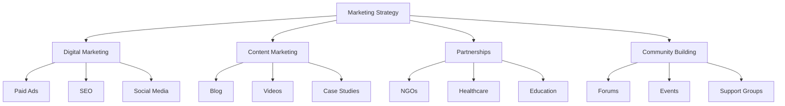
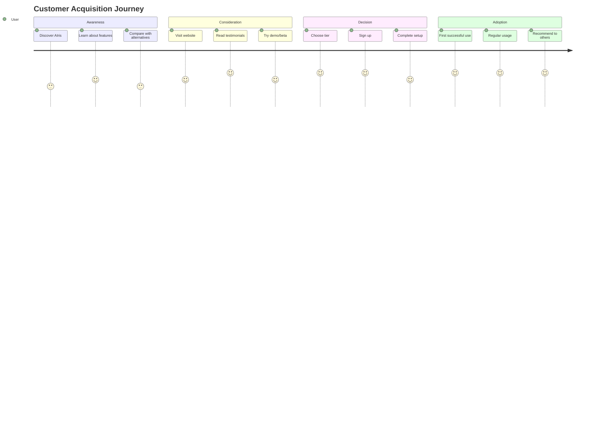

# Go-to-Market Strategy

**Comprehensive launch and growth strategy**

---

## 🚀 Launch Strategy

### Phase 1: Pre-Launch (Months -3 to 0)

**Objectives:**
- Build awareness
- Gather beta users
- Validate product-market fit
- Establish partnerships

**Activities:**
1. **Beta Program**
   - Recruit 50-100 beta users
   - Free access for feedback
   - Iterate based on usage

2. **Content Marketing**
   - Blog posts about accessibility
   - Demo videos
   - Social media presence

3. **Partnership Development**
   - Contact disability organizations
   - Healthcare providers
   - Educational institutions

4. **PR & Media**
   - Press releases
   - Tech blog features
   - Local media coverage

### Phase 2: Soft Launch (Months 1-3)

**Objectives:**
- Launch to beta users
- Refine pricing
- Gather testimonials
- Build case studies

**Activities:**
1. **Beta User Conversion**
   - Convert beta users to paid
   - Early adopter pricing (50% off)
   - Gather success stories

2. **Limited Public Launch**
   - Invite-only signups
   - Controlled growth
   - Focus on quality

3. **Support Infrastructure**
   - Customer support system
   - Documentation
   - Training materials

### Phase 3: Public Launch (Months 4-6)

**Objectives:**
- Public availability
- Marketing campaigns
- Scale user acquisition
- Establish brand

**Activities:**
1. **Public Launch Event**
   - Official announcement
   - Media coverage
   - Partnership announcements

2. **Marketing Campaigns**
   - Paid advertising
   - Content marketing
   - Social media campaigns

3. **Channel Development**
   - Website optimization
   - Sales process
   - Onboarding flow

---

## 📢 Marketing Strategy

### Marketing Mix

### Digital Marketing

#### Paid Advertising

**Channels:**
- **Google Ads** — Search and display
- **Facebook/Instagram** — Targeted ads
- **YouTube** — Video ads
- **LinkedIn** — B2B targeting

**Budget:** $500-2,000/month
**Target:** $30-50 CAC

#### SEO Strategy

**Keywords:**
- "vision assistant for blind"
- "AI for visually impaired"
- "object finding app"
- "assistive technology Bangladesh"

**Content:**
- Blog posts
- Guides
- Case studies
- FAQ pages

#### Social Media

**Platforms:**
- **Facebook** — Community building
- **YouTube** — Demo videos
- **LinkedIn** — Professional network
- **Twitter** — Updates and engagement

### Content Marketing

#### Blog Content

**Topics:**
- Accessibility technology
- User success stories
- How-to guides
- Industry news

**Frequency:** 2-4 posts/month

#### Video Content

**Types:**
- Product demos
- User testimonials
- Tutorial videos
- Behind-the-scenes

**Platform:** YouTube, embedded on website

#### Case Studies

**Focus:**
- Real user stories
- Impact measurement
- Before/after scenarios
- ROI for users

---

## 🤝 Partnership Strategy

### Partnership Types

#### 1. Disability Organizations

**Partners:**
- Bangladesh National Society for the Blind
- Local disability NGOs
- International organizations

**Value Exchange:**
- **For Partner:** Enhanced services for members
- **For AIris:** User referrals, credibility

**Structure:**
- Referral program
- Member discounts
- Co-marketing opportunities

#### 2. Healthcare Providers

**Partners:**
- Eye hospitals
- Rehabilitation centers
- Home care services

**Value Exchange:**
- **For Partner:** Patient care enhancement
- **For AIris:** Patient referrals

**Structure:**
- Medical professional discounts
- Patient education programs
- Clinical partnerships

#### 3. Educational Institutions

**Partners:**
- Schools for the blind
- Universities
- Training centers

**Value Exchange:**
- **For Partner:** Student support tools
- **For AIris:** Student user base

**Structure:**
- Educational discounts
- Training programs
- Research partnerships

#### 4. Government Programs

**Partners:**
- Ministry of Social Welfare
- Public health programs
- Disability services

**Value Exchange:**
- **For Partner:** Public service enhancement
- **For AIris:** Large-scale deployment

**Structure:**
- Government contracts
- Subsidized pricing
- Public health integration

---

## 📊 Customer Acquisition Channels

### Channel Mix

<table>
<thead>
<tr>
<th>Channel</th>
<th>Year 1 %</th>
<th>CAC</th>
<th>Volume</th>
</tr>
</thead>
<tbody>
<tr>
<td><strong>Organic/Social</strong></td>
<td>30%</td>
<td>$15</td>
<td>300 users</td>
</tr>
<tr>
<td><strong>Paid Ads</strong></td>
<td>25%</td>
<td>$40</td>
<td>250 users</td>
</tr>
<tr>
<td><strong>Partnerships</strong></td>
<td>30%</td>
<td>$25</td>
<td>300 users</td>
</tr>
<tr>
<td><strong>Referrals</strong></td>
<td>10%</td>
<td>$10</td>
<td>100 users</td>
</tr>
<tr>
<td><strong>Direct/Other</strong></td>
<td>5%</td>
<td>$20</td>
<td>50 users</td>
</tr>
</tbody>
</table>

### Channel Strategy

#### Organic Growth

**Tactics:**
- SEO optimization
- Content marketing
- Social media engagement
- Community building

**Advantages:**
- Low CAC
- Sustainable growth
- Brand building

**Challenges:**
- Slow initial growth
- Requires consistent effort

#### Paid Acquisition

**Tactics:**
- Google Ads (search)
- Facebook/Instagram ads
- YouTube video ads
- Retargeting campaigns

**Advantages:**
- Fast growth
- Scalable
- Measurable

**Challenges:**
- Higher CAC
- Requires budget
- Competition

#### Partnerships

**Tactics:**
- NGO partnerships
- Healthcare referrals
- Educational programs
- Government contracts

**Advantages:**
- Credibility
- Lower CAC
- Volume potential

**Challenges:**
- Relationship building
- Longer sales cycle
- Custom requirements

---

## 🎯 Target Customer Acquisition

### Year 1 Goals

| Quarter | New Users | Total Users | MRR |
|:--------|:---------:|:-----------:|:---:|
| **Q1** | 100 | 100 | $1,200 |
| **Q2** | 200 | 300 | $3,600 |
| **Q3** | 300 | 600 | $7,200 |
| **Q4** | 400 | 1,000 | $12,000 |

### Acquisition Strategy by Quarter

#### Q1: Foundation
- **Focus:** Beta conversion, early adopters
- **Channels:** Organic, partnerships
- **Budget:** $1,500
- **Target:** 100 users

#### Q2: Growth
- **Focus:** Paid ads, content marketing
- **Channels:** Paid, organic, partnerships
- **Budget:** $3,000
- **Target:** 200 new users

#### Q3: Scale
- **Focus:** All channels, optimize
- **Channels:** All channels
- **Budget:** $5,000
- **Target:** 300 new users

#### Q4: Accelerate
- **Focus:** Scale successful channels
- **Channels:** Paid, partnerships
- **Budget:** $8,000
- **Target:** 400 new users

---

## 💼 Sales Process

### Customer Journey

### Sales Funnel

1. **Awareness** (10,000 visitors)
   - Website traffic
   - Social media
   - Content marketing

2. **Interest** (1,000 leads)
   - Email signups
   - Demo requests
   - Beta applications

3. **Consideration** (200 trials)
   - Free trials
   - Beta access
   - Demo accounts

4. **Conversion** (100 customers)
   - Paid subscriptions
   - 50% conversion rate
   - $25 average CAC

### Conversion Optimization

**Key Metrics:**
- Website conversion: 1-2%
- Trial to paid: 50%
- Email open rate: 25%
- Click-through rate: 5%

**Optimization Tactics:**
- A/B testing
- Landing page optimization
- Email campaigns
- Retargeting

---

## 🎓 Customer Onboarding

### Onboarding Flow

1. **Sign Up**
   - Simple registration
   - Email verification
   - Account creation

2. **Setup Guide**
   - Step-by-step instructions
   - Video tutorials
   - Support available

3. **First Use**
   - Guided tutorial
   - Sample tasks
   - Success celebration

4. **Ongoing Support**
   - Help center
   - Video library
   - Community forum

### Success Metrics

- **Time to first value:** <30 minutes
- **Setup completion:** >80%
- **First week retention:** >70%
- **30-day retention:** >60%

---

## 📈 Growth Tactics

### Viral Growth

**Referral Program:**
- Referrer: 1 month free
- New user: 1 month free
- Unlimited referrals
- Trackable links

**Social Sharing:**
- Share success stories
- Social media integration
- User-generated content

### Retention Strategies

1. **Regular Updates**
   - New features
   - Improvements
   - Bug fixes

2. **Engagement**
   - Email newsletters
   - Feature announcements
   - User community

3. **Support**
   - Quick response
   - Helpful resources
   - Proactive outreach

### Expansion Revenue

1. **Upselling**
   - Basic → Pro
   - Pro → Family
   - Feature add-ons

2. **Hardware Sales**
   - Bundle offers
   - Upgrade prompts
   - New product launches

3. **Enterprise**
   - Institutional sales
   - Volume discounts
   - Custom features

---

## 🎯 Success Metrics

### Acquisition Metrics

- **CAC by channel**
- **Conversion rates**
- **Cost per lead**
- **Channel ROI**

### Engagement Metrics

- **Daily active users**
- **Monthly active users**
- **Feature adoption**
- **Session duration**

### Retention Metrics

- **Churn rate**
- **Retention cohorts**
- **Lifetime value**
- **Net revenue retention**

### Business Metrics

- **MRR growth**
- **ARR**
- **Gross margin**
- **Net margin**

---

## ✅ Go-to-Market Checklist

### Pre-Launch
- [ ] Beta program complete
- [ ] Product ready
- [ ] Pricing validated
- [ ] Partnerships established
- [ ] Marketing materials ready
- [ ] Support system in place

### Launch
- [ ] Website live
- [ ] Payment processing
- [ ] Onboarding flow
- [ ] Marketing campaigns
- [ ] PR launch
- [ ] Support team ready

### Post-Launch
- [ ] Monitor metrics
- [ ] Gather feedback
- [ ] Optimize conversion
- [ ] Scale successful channels
- [ ] Iterate and improve

---

**A comprehensive strategy to launch and grow AIris**

*Next: [Value Proposition](./06-Value-Proposition.md)*

