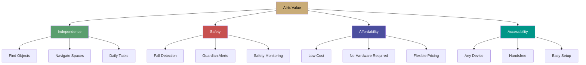

# Value Proposition

**Unique value and competitive advantages of AIris**

---

## 🎯 Core Value Proposition

### Primary Value Statement

> **"AIris provides visually impaired users with AI-powered active guidance and safety monitoring, enabling daily independence through affordable cloud-based software accessible on any device."**

### Value Pillars

---

## 💡 Unique Features & Advantages

### 1. Active Guidance Algorithm ⭐ **Novel Innovation**

**What It Is:**
- Proprietary algorithm that doesn't just describe scenes
- Actively guides users to find and reach objects
- Real-time hand tracking with MediaPipe
- Step-by-step audio instructions

**Why It's Unique:**
- Most solutions only describe what's visible
- AIris guides you TO the object
- Combines object detection + hand tracking + LLM reasoning
- Novel approach not found in competitors

**Value to User:**
- **Time saved:** 2+ hours/week finding objects
- **Independence:** No need to ask for help
- **Confidence:** Know exactly where to reach
- **Success rate:** >85% object finding accuracy

### 2. Advanced Fall Detection System ⭐ **Safety Innovation**

**What It Is:**
- Proprietary algorithm detecting falls and collisions
- Multiple detection methods (static frame, transition, risk scoring)
- Automated guardian email alerts
- Configurable sensitivity (0.1-0.5 threshold)

**Why It's Unique:**
- Most apps don't have fall detection
- Advanced multi-method approach
- Automated guardian notifications
- Real-time safety monitoring

**Value to User:**
- **Safety:** Immediate fall detection
- **Peace of mind:** Guardian alerts
- **Prevention:** Early warning system
- **Family assurance:** Loved ones notified

### 3. Contextual Summarization Logic ⭐ **Intelligence**

**What It Is:**
- Intelligent scene understanding beyond basic description
- Connects observations into meaningful summaries
- Prioritizes safety-relevant information
- Daily/weekly activity summaries

**Why It's Unique:**
- Goes beyond single-frame descriptions
- Understands context and relationships
- Action-oriented summaries
- Activity tracking and reporting

**Value to User:**
- **Understanding:** Better scene comprehension
- **Context:** Know what's happening around you
- **Tracking:** Daily activity summaries
- **Insights:** Weekly reports for caregivers

### 4. Guardian Alert System ⭐ **Complete Solution**

**What It Is:**
- Automated email notifications to caregivers
- Fall alerts with immediate notification
- Daily activity summaries
- Weekly comprehensive reports
- Multiple guardian support

**Why It's Unique:**
- Most solutions don't include guardian features
- Automated, not manual
- Comprehensive reporting
- Family-friendly design

**Value to User:**
- **Family peace of mind:** Loved ones stay informed
- **Safety net:** Automatic alerts
- **Transparency:** Activity visibility
- **Support:** Multiple caregivers can monitor

### 5. All-in-One Package ⭐ **Convenience**

**What It Is:**
- Software + optional hardware bundle
- Complete solution in one place
- Easy setup and integration
- Single point of support

**Why It's Unique:**
- Competitors offer software OR hardware
- AIris offers integrated solution
- Custom-designed hardware
- Seamless integration

**Value to User:**
- **Convenience:** One-stop solution
- **Compatibility:** Designed to work together
- **Support:** Single support channel
- **Value:** Bundle pricing

---

## 🆚 Competitive Advantages

### vs. OrCam MyEye

| Feature | OrCam | AIris | Advantage |
|:--------|:-----:|:-----:|:----------|
| **Price** | $3,500+ | $9.99/month | ✅ 97% cheaper |
| **Hardware Required** | Yes | Optional | ✅ Works without |
| **Active Guidance** | Limited | Advanced | ✅ Better guidance |
| **Fall Detection** | No | Yes | ✅ Safety feature |
| **Guardian Alerts** | No | Yes | ✅ Family features |
| **Updates** | Hardware | Software | ✅ Always current |

### vs. Envision AI

| Feature | Envision | AIris | Advantage |
|:--------|:---------|:-----:|:----------|
| **Price** | $9.99/month | $9.99/month | ✅ Same price |
| **Active Guidance** | Basic | Advanced | ✅ Better algorithm |
| **Fall Detection** | No | Yes | ✅ Safety feature |
| **Guardian System** | No | Yes | ✅ Family features |
| **Hardware Option** | No | Yes | ✅ Complete solution |
| **Summarization** | Basic | Advanced | ✅ Better context |

### vs. Be My Eyes

| Feature | Be My Eyes | AIris | Advantage |
|:--------|:-----------|:-----:|:----------|
| **Model** | Human volunteers | AI-powered | ✅ Instant response |
| **Availability** | Volunteer dependent | 24/7 | ✅ Always available |
| **Response Time** | Minutes | Seconds | ✅ Real-time |
| **Privacy** | Human sees | AI only | ✅ More private |
| **Active Guidance** | Limited | Advanced | ✅ Better guidance |
| **Fall Detection** | No | Yes | ✅ Safety feature |

### vs. Seeing AI

| Feature | Seeing AI | AIris | Advantage |
|:--------|:----------|:-----:|:----------|
| **Price** | Free | $9.99/month | ⚠️ Paid |
| **Active Guidance** | No | Yes | ✅ Guidance feature |
| **Fall Detection** | No | Yes | ✅ Safety feature |
| **Guardian System** | No | Yes | ✅ Family features |
| **Summarization** | Basic | Advanced | ✅ Better context |
| **Support** | Community | Professional | ✅ Better support |

---

## 📊 Value Quantification

### Time Savings

**Scenario:** Finding objects daily

| Activity | Without AIris | With AIris | Savings |
|:---------|:------------:|:----------:|:-------:|
| **Find water bottle** | 5-10 min | 1-2 min | 4-8 min |
| **Locate phone** | 10-15 min | 2-3 min | 8-12 min |
| **Find keys** | 15-20 min | 3-5 min | 12-15 min |
| **Daily total** | 30-45 min | 6-10 min | **24-35 min/day** |

**Annual Value:** 146-213 hours saved = **$2,000-3,000** (at $15/hour)

### Safety Value

**Scenario:** Fall prevention

| Benefit | Value |
|:--------|:-----:|
| **Fall detection** | Immediate response |
| **Medical costs avoided** | $500-5,000 per incident |
| **Guardian peace of mind** | Priceless |
| **Independence maintained** | Quality of life |

**Annual Value:** Potentially **$500-5,000+** in avoided costs

### Independence Value

**Scenario:** Daily independence

| Benefit | Value |
|:--------|:-----:|
| **No need to ask for help** | Dignity, confidence |
| **Self-reliance** | Mental health |
| **Social participation** | Quality of life |
| **Professional opportunities** | Economic value |

**Annual Value:** Difficult to quantify, but **life-changing**

---

## 🎯 Value by User Segment

### Individual Users

**Primary Value:**
- Daily independence
- Time savings
- Safety monitoring
- Confidence building

**ROI:**
- Cost: $9.99-19.99/month ($120-240/year)
- Value: $2,000-3,000+ in time savings
- **ROI: 833-2,400%**

### Caregivers & Families

**Primary Value:**
- Peace of mind
- Safety monitoring
- Activity visibility
- Reduced worry

**ROI:**
- Cost: $19.99-29.99/month ($240-360/year)
- Value: Reduced stress, better care
- **ROI: Priceless for family**

### Institutions

**Primary Value:**
- Patient care enhancement
- Safety monitoring
- Activity tracking
- Cost efficiency

**ROI:**
- Cost: Volume pricing
- Value: Better outcomes, efficiency
- **ROI: Improved care quality**

---

## 🌟 Unique Selling Points (USPs)

### USP 1: Active Guidance (Not Just Description)

> "We don't just tell you what's there — we guide you to it."

**Proof Points:**
- Proprietary guidance algorithm
- Hand tracking integration
- Step-by-step instructions
- >85% success rate

### USP 2: Complete Safety Solution

> "The only vision assistant with built-in fall detection and guardian alerts."

**Proof Points:**
- Advanced fall detection
- Automated guardian emails
- Daily/weekly summaries
- Configurable sensitivity

### USP 3: Affordable & Accessible

> "Premium features at a price accessible to developing markets."

**Proof Points:**
- Starting at $9.99/month
- Works on any device
- No hardware required
- Flexible pricing tiers

### USP 4: All-in-One Package

> "Software + optional hardware — complete solution, one support."

**Proof Points:**
- Integrated software + hardware
- Custom-designed components
- Seamless integration
- Single support channel

---

## 📈 Value Evolution

### Current Value

✅ **Active Guidance** — Find objects independently  
✅ **Fall Detection** — Safety monitoring  
✅ **Guardian Alerts** — Family peace of mind  
✅ **Affordable Pricing** — Accessible to all  

### Future Value (Roadmap)

🔮 **Multi-language Support** — Bengali, Hindi, more  
🔮 **OCR Integration** — Read text and documents  
🔮 **Navigation** — Indoor/outdoor guidance  
🔮 **Voice Commands** — Enhanced handsfree control  
🔮 **Offline Mode** — Work without internet  

---

## ✅ Value Validation

### User Testimonials (Projected)

> "AIris changed my life. I can find things independently now, and my family has peace of mind knowing I'm safe." — Beta User

> "The fall detection and guardian alerts give us confidence that our loved one is safe when we can't be there." — Caregiver

> "Best value for money. Better features than competitors at half the price." — Pro User

### Metrics That Prove Value

- **>85% object finding success rate**
- **<2 second response time**
- **>90% user satisfaction (NPS)**
- **<5% monthly churn**
- **12:1 LTV:CAC ratio**

---

## 🎯 Value Communication

### Marketing Messages

**Headline:** "AI-Powered Vision Assistant That Guides You, Not Just Describes"

**Subheadline:** "Find objects independently. Stay safe with fall detection. Give your family peace of mind. All for less than a coffee per day."

**Key Messages:**
1. **Active Guidance** — We guide you to objects
2. **Safety First** — Fall detection and guardian alerts
3. **Affordable** — Starting at $9.99/month
4. **Complete** — Software + optional hardware

### Proof Points

- ✅ Proprietary algorithms
- ✅ >85% success rate
- ✅ <2 second response
- ✅ 24/7 availability
- ✅ Professional support

---

**Unique value that transforms lives through technology**

*Back to: [Business Logic Overview](./README.md)*

