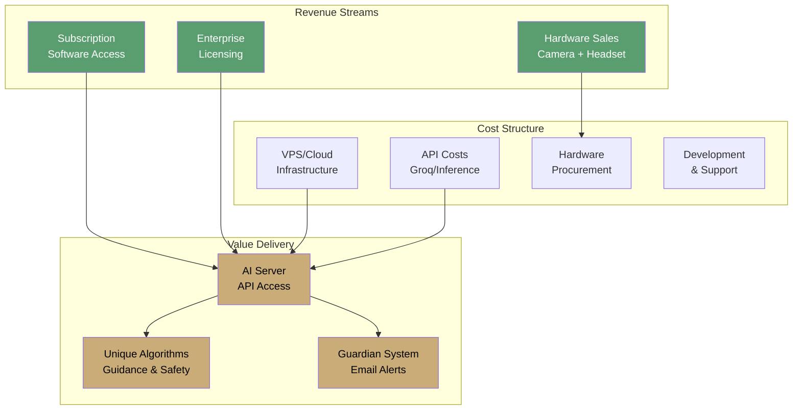
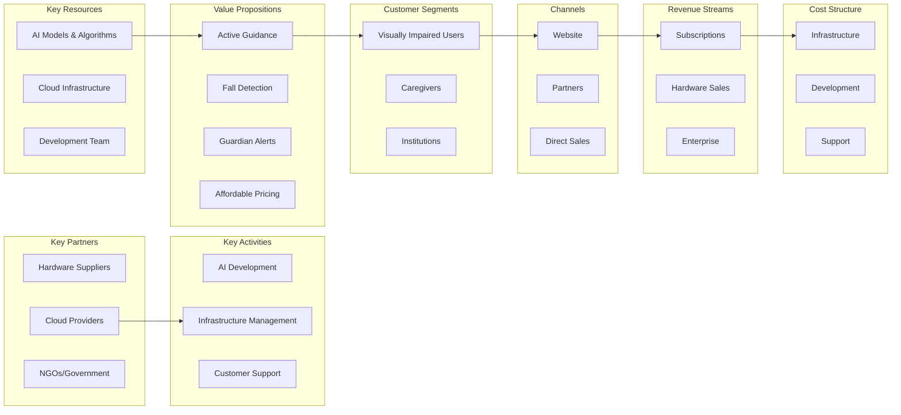

# AIris Business Logic & Strategy

**Comprehensive business strategy and financial model for AIris**

---

## 📚 Documentation Structure

This folder contains the complete business logic, strategy, and financial planning for AIris as a Software-as-a-Service (SaaS) platform.

### Core Documents

| Document | Purpose | Status |
|:---------|:--------|:------:|
| **[Business Model](./01-Business-Model.md)** | Core business model, value proposition, and revenue streams | ✅ Complete |
| **[Pricing Strategy](./02-Pricing-Strategy.md)** | Subscription tiers, hardware pricing, and market positioning | ✅ Complete |
| **[Market Analysis](./03-Market-Analysis.md)** | Target market, competition, and market opportunity | ✅ Complete |
| **[Financial Model](./04-Financial-Model.md)** | Cost structure, revenue projections, and unit economics | ✅ Complete |
| **[Go-to-Market](./05-Go-to-Market.md)** | Launch strategy, marketing, and customer acquisition | ✅ Complete |
| **[Value Proposition](./06-Value-Proposition.md)** | Unique features, benefits, and competitive advantages | ✅ Complete |

---

## 🎯 Executive Summary

AIris is positioned as an **affordable, accessible AI-powered vision assistant** for visually impaired users, delivered as a cloud-based SaaS platform.

### Key Business Principles

1. **Accessibility First** — Pricing must be affordable for users in developing markets
2. **Fair & Transparent** — No hidden costs, clear value delivery
3. **Sustainable Growth** — Profitable enough to maintain and improve service
4. **Social Impact** — Balancing business needs with social responsibility

### Business Model Overview

---

## 💰 Quick Pricing Overview

### Software Subscriptions

| Tier | Monthly (USD) | Monthly (BDT) | Annual (USD) | Annual (BDT) |
|:-----|:------------:|:-------------:|:------------:|:------------:|
| **Basic** | $9.99 | ৳1,099 | $99.99 | ৳10,999 |
| **Pro** | $19.99 | ৳2,199 | $199.99 | ৳21,999 |
| **Family** | $29.99 | ৳3,299 | $299.99 | ৳32,999 |

### Hardware Bundle

| Item | Price (USD) | Price (BDT) |
|:-----|:-----------:|:-----------:|
| Custom ESP32-CAM with Casing | $12.99 | ৳1,429 |
| Bluetooth Headset (Mic + Audio) | $13.99 | ৳1,539 |
| **Complete Bundle** | **$24.99** | **৳2,749** |

*All prices include local taxes and shipping within Bangladesh*

---

## 🎯 Target Market

### Primary Market
- **Visually impaired individuals** in Bangladesh and South Asia
- **Estimated market size**: 2.5M+ visually impaired in Bangladesh
- **Addressable market**: ~500K with smartphone/computer access

### Secondary Markets
- Caregivers and family members
- Healthcare institutions
- Educational institutions
- NGOs and disability organizations

---

## 🚀 Why This Business Model?

### 1. **Server Costs Justification**
- AI inference requires GPU resources
- Continuous model updates and improvements
- 24/7 availability and reliability
- Scalable infrastructure for growing user base

### 2. **Sustainable Development**
- Revenue enables feature development
- Continuous algorithm improvements
- Security updates and maintenance
- Customer support and service

### 3. **Fair Value Exchange**
- Users pay for ongoing service, not just software
- Transparent pricing with no hidden fees
- Optional hardware for enhanced experience
- Free tier consideration for accessibility

### 4. **Social Impact**
- Affordable pricing for developing markets
- Potential partnerships with NGOs/government
- Educational discounts
- Community support programs

---

## 📊 Key Metrics

| Metric | Target | Rationale |
|:-------|:------:|:----------|
| **Monthly Recurring Revenue (MRR)** | $10K+ | Sustainable operations |
| **Customer Acquisition Cost (CAC)** | <$50 | Efficient growth |
| **Lifetime Value (LTV)** | >$300 | 3x+ CAC ratio |
| **Churn Rate** | <5% | High retention |
| **Gross Margin** | >70% | Healthy profitability |

---

## 🔄 Business Model Canvas

---

## 📈 Growth Strategy

### Phase 1: Launch (Months 1-6)
- Beta testing with 100-500 users
- Refine pricing and features
- Build initial customer base
- Establish partnerships

### Phase 2: Scale (Months 7-18)
- Expand to 1,000-5,000 users
- International expansion
- Enterprise partnerships
- Hardware distribution

### Phase 3: Optimize (Months 19+)
- 10,000+ users
- Advanced features
- Market leadership
- Social impact programs

---

## 🤝 Partnerships & Alliances

### Potential Partners
- **Disability Organizations** — Distribution and advocacy
- **Healthcare Providers** — Patient referrals
- **Educational Institutions** — Student programs
- **Government** — Subsidized access programs
- **Hardware Retailers** — Bundle sales

---

## 📞 Next Steps

1. Review each document in this folder
2. Validate assumptions with market research
3. Refine pricing based on cost analysis
4. Develop go-to-market execution plan
5. Establish partnerships and channels

---

**Building a sustainable, impactful business that serves the visually impaired community**

*Last Updated: December 2025*

