# Visualizations & Diagrams

### 1. Main System Architecture Diagram
(To be rendered prominently in the center or top-right)

```mermaid
graph TB
    subgraph "User Device (Computer/Phone)"
    Input[🎥 Video Stream<br/>Webcam/ESP32-CAM]
    AudioIn[🎤 Audio Input<br/>Mic/Bluetooth]
    end
    
    subgraph "Local Processing (FastAPI Server)"
    Backbone[🚀 FastAPI Backend<br/>Python 3.10+]
    Input --> Backbone
    AudioIn --> Backbone
    
    Backbone -->|Frames| YOLO[🎯 YOLO26s<br/>Object Detection]
    Backbone -->|Frames| MP[✋ MediaPipe<br/>Hand Tracking 21pts]
    Backbone -->|Frames| BLIP[🖼️ BLIP<br/>Scene Captioning]
    
    YOLO -->|Object Coords| Logic[🧠 Guidance Logic<br/>Vector Calculation]
    MP -->|Hand Coords| Logic
    BLIP -->|Captions| SceneLogic[🔍 Scene Analysis<br/>Fall Detection]
    
    Logic -->|Direction| TTS[🔊 Web Speech API<br/>Text-to-Speech]
    SceneLogic -->|Alerts| Email[📧 Email Service<br/>Guardian Alerts]
    TTS --> Output[🎧 Audio Output<br/>Speakers/Bluetooth]
    end
    
    subgraph "Frontend (React/TypeScript)"
    STT[🎤 Web Speech API<br/>Speech Recognition]
    STT -->|Voice Commands| Backbone
    end
    
    subgraph "Cloud Inference (Groq API)"
    Backbone -.->|Goal| GPT1[🤖 GPT OSS120B<br/>Object Extraction]
    Backbone -.->|Buffer| GPT2[🤖 GPT OSS120B<br/>Summarization]
    GPT1 -.->|Object Name| Backbone
    GPT2 -.->|Summaries| Backbone
    end
    
    style Backbone fill:#C9AC78,stroke:#1D1D1D,stroke-width:3px
    style Logic fill:#5A9E6F,stroke:#1D1D1D,stroke-width:2px
    style SceneLogic fill:#C75050,stroke:#1D1D1D,stroke-width:2px
    style YOLO fill:#4B4E9E,stroke:#fff,stroke-width:2px
    style MP fill:#4B4E9E,stroke:#fff,stroke-width:2px
    style BLIP fill:#4B4E9E,stroke:#fff,stroke-width:2px
    style GPT1 fill:#009688,stroke:#fff,stroke-width:2px
    style GPT2 fill:#009688,stroke:#fff,stroke-width:2px
    style STT fill:#C9AC78,stroke:#1D1D1D,stroke-width:2px
    style TTS fill:#C9AC78,stroke:#1D1D1D,stroke-width:2px
```



### 2. "Active Guidance" Flowchart
(Showing the decision loop for finding an object)

```mermaid
graph LR
    A[🎤 Voice: 'Find Object'] --> B[🤖 GPT OSS120B<br/>Extract Object from Goal]
    B --> C[🎯 YOLO26s<br/>Object Detection]
    C --> D{Object<br/>Detected?}
    D -- No --> E[🔊 'Rotate camera<br/>to find object']
    E --> C
    D -- Yes --> F[✋ MediaPipe<br/>Hand Tracking]
    F --> G{Hand<br/>Visible?}
    G -- No --> H[🔊 'Show your hand<br/>in frame']
    H --> F
    G -- Yes --> I[📐 Calculate Vector<br/>V = P_obj - P_hand]
    I --> J[📏 Depth Estimation<br/>Bounding Box Ratio]
    J --> K[⚙️ Rule-Based Algorithm<br/>Generate Directions (No LLM)]
    K --> L[🔊 Web Speech API TTS:<br/>'Move left and forward']
    L --> M[📏 Distance Check]
    M --> N{Hand-Object<br/>Contact?}
    N -- No --> I
    N -- Yes --> O[🔊 'Object found!<br/>You can reach it']
    
    style A fill:#C9AC78,stroke:#1D1D1D,stroke-width:2px
    style B fill:#009688,stroke:#fff,stroke-width:2px
    style C fill:#4B4E9E,stroke:#fff,stroke-width:2px
    style F fill:#4B4E9E,stroke:#fff,stroke-width:2px
    style I fill:#5A9E6F,stroke:#1D1D1D,stroke-width:2px
    style J fill:#5A9E6F,stroke:#1D1D1D,stroke-width:2px
    style K fill:#5A9E6F,stroke:#1D1D1D,stroke-width:3px
    style L fill:#C9AC78,stroke:#1D1D1D,stroke-width:2px
    style O fill:#5A9E6F,stroke:#1D1D1D,stroke-width:3px
```

### 3. Latency Comparison Bar Chart
(Visualizing the performance jump)
- **X-Axis:** Pipeline Version
- **Y-Axis:** Response Time (seconds)
- **Bar 1 (Red #C75050):** Prototype (BLIP+GPT) - 14.1s
- **Bar 2 (Green #5A9E6F):** Final (YOLO26s+GPT OSS120B) - 1.8s
- *Annotation:* "Real-time Threshold (2s)" dashed line in gold (#C9AC78)
- *Style:* Flat, scientific bar chart on white background with AIris brand colors

### 4. Fall Detection Algorithm Flow
(Showing multi-method safety system)

```mermaid
graph TB
    A[📹 Video Frame<br/>2 FPS] --> B[🖼️ BLIP Caption]
    B --> C[🔍 Quick Risk Assessment<br/>Keyword-based]
    B --> D[📊 Static Frame Detection<br/>Wall/Floor/Ceiling]
    B --> E[📈 Transition Detection<br/>Abrupt Changes]
    
    C --> F[📦 Frame Buffer<br/>5-10 frames]
    D --> F
    E --> F
    
    F --> G[🤖 GPT OSS120B<br/>Summarization & Risk Scoring]
    
    G --> H{Risk Score<br/>> Threshold?}
    
    H -- Yes --> I[🚨 Fall Alert]
    H -- No --> J[✅ Normal Activity]
    
    I --> K[📧 Guardian Email<br/>Automated Alert]
    K --> L[⏱️ Cooldown Timer<br/>Prevent Spam]
    
    style A fill:#4B4E9E,stroke:#fff,stroke-width:2px
    style B fill:#4B4E9E,stroke:#fff,stroke-width:2px
    style C fill:#1D1D1D,stroke:#fff,stroke-width:2px
    style D fill:#1D1D1D,stroke:#fff,stroke-width:2px
    style E fill:#1D1D1D,stroke:#fff,stroke-width:2px
    style F fill:#1D1D1D,stroke:#fff,stroke-width:2px
    style G fill:#009688,stroke:#fff,stroke-width:2px
    style I fill:#C75050,stroke:#fff,stroke-width:3px
    style J fill:#5A9E6F,stroke:#1D1D1D,stroke-width:2px
    style K fill:#C9AC78,stroke:#1D1D1D,stroke-width:2px
```



### 5. System Modes Comparison
(Flat, scientific diagram showing dual modes)

```mermaid
graph LR
    subgraph "Active Guidance Mode"
    A1[🤖 Object Extraction<br/>GPT OSS120B] --> A2[🎯 Object Detection<br/>YOLO26s]
    A2 --> A3[✋ Hand Tracking<br/>MediaPipe]
    A3 --> A4[📐 Vector Calculation]
    A4 --> A5[📏 Depth Estimation]
    A5 --> A6[⚙️ Rule-Based Guidance<br/>Novel Algorithm]
    A6 --> A7[🔊 Audio Guidance]
    end
    
    subgraph "Scene Description Mode"
    B1[🖼️ Scene Captioning<br/>BLIP (2 FPS)] --> B2[🔍 Quick Risk Assessment<br/>Keyword-based]
    B2 --> B3[📊 Static Frame Detection<br/>Fall Indicators]
    B3 --> B4[📈 Transition Detection<br/>Abrupt Changes]
    B4 --> B5[📦 Buffer Accumulation<br/>5-10 frames]
    B5 --> B6[🤖 GPT OSS120B<br/>Summarization & Risk Scoring]
    B6 --> B7[🚨 Fall Detection<br/>Multi-method Analysis]
    B7 --> B8[📧 Guardian Alerts<br/>Email System]
    end
    
    style A1 fill:#009688,stroke:#fff,stroke-width:2px
    style A2 fill:#4B4E9E,stroke:#fff,stroke-width:2px
    style A3 fill:#4B4E9E,stroke:#fff,stroke-width:2px
    style A4 fill:#5A9E6F,stroke:#1D1D1D,stroke-width:2px
    style A5 fill:#5A9E6F,stroke:#1D1D1D,stroke-width:2px
    style A6 fill:#5A9E6F,stroke:#1D1D1D,stroke-width:3px
    style A7 fill:#C9AC78,stroke:#1D1D1D,stroke-width:2px
    style B1 fill:#4B4E9E,stroke:#fff,stroke-width:2px
    style B2 fill:#1D1D1D,stroke:#fff,stroke-width:2px
    style B3 fill:#1D1D1D,stroke:#fff,stroke-width:2px
    style B4 fill:#1D1D1D,stroke:#fff,stroke-width:2px
    style B5 fill:#1D1D1D,stroke:#fff,stroke-width:2px
    style B6 fill:#009688,stroke:#fff,stroke-width:2px
    style B7 fill:#C75050,stroke:#fff,stroke-width:2px
    style B8 fill:#C9AC78,stroke:#1D1D1D,stroke-width:2px
```
