<div align="center">

# 🔌 AIris Hardware Accessories


**Optional hardware accessories for enhanced handsfree operation**

> **Note:** AIris runs entirely on your computer with built-in webcam/mic. These accessories are optional addons for wireless operation.

---

</div>

## Overview

This folder contains firmware, test code, and **custom hardware designs** for AIris accessories. The core AIris system runs entirely on your computer with built-in webcam/mic, but we've designed a **custom ESP32-CAM with protective casing** for enhanced handsfree operation.

**Recommended:** Custom ESP32-CAM with AIris-designed casing (see `cam-casing/`)  
**Default:** Computer with built-in webcam and speakers/mic (works perfectly)  
**Optional:** Bluetooth mic/headphone for wireless audio

```mermaid
graph LR
    subgraph "🔌 Optional Accessories"
        A[📷 Custom ESP32-CAM<br/>with Casing]
        B[🎤 Bluetooth<br/>Microphone]
        C[🎧 Bluetooth<br/>Headphone]
    end
    
    subgraph "💻 Computer"
        E[⚡ FastAPI<br/>Backend]
    end
    
    A -->|WiFi<br/>Video Stream| E
    B -->|Bluetooth<br/>Audio Input| E
    E -->|Bluetooth<br/>Audio Output| C
    
    style A fill:#E7352C,color:#fff
    style B fill:#00979D,color:#fff
    style C fill:#00979D,color:#fff
    style E fill:#009688,color:#fff
```



**Architecture Note**: The core system runs on your computer. These are **optional accessories**:
- **Custom ESP32-CAM with casing** for wireless video streaming (WiFi) — recommended for handsfree camera positioning
- **Bluetooth Microphone** for wireless voice input
- **Bluetooth Headphone** for wireless audio output

These accessories are optional — the system works perfectly with built-in webcam/mic. Handsfree mode uses voice commands for all control.

---

## Components

### 📷 Custom ESP32-CAM with Casing ⭐ **Recommended**

We've designed a **custom ESP32-CAM setup with a protective casing** specifically for AIris. This provides:
- **Professional appearance** — Custom-designed 3D printed case
- **Protection** — Safeguards the ESP32-CAM module
- **Handsfree positioning** — Wireless camera for optimal placement
- **Durability** — Designed for daily use

| Specification | Value |
|:--------------|:------|
| **Chip** | ESP32-S |
| **Camera** | OV2640 (2MP) |
| **Connectivity** | WiFi 802.11 b/g/n |
| **Flash** | 4MB |
| **Casing** | Custom 3D printed (STL file included) |
| **Purpose** | Wireless video streaming to computer |

**Files:**
- `cam-casing/airis-case.stl` — 3D printable case design
- `esp32-cam-test/` — Firmware and test code

**Current Status:** ✅ Casing design complete | 🔄 WiFi streaming integration in progress

> **Note:** While we recommend using our custom ESP32-CAM setup, the system works perfectly with your computer's built-in webcam. The custom camera is an optional enhancement for handsfree operation.

### 🎤 Bluetooth Microphone

| Component | Purpose |
|:----------|:--------|
| **Bluetooth Mic** | Voice command input |
| **Connection** | Bluetooth → Server |
| **Purpose** | Hands-free voice control |

**Current Status:** 🔄 Bluetooth pairing in progress

### 🎧 Bluetooth Headphone

| Component | Purpose |
|:----------|:--------|
| **Bluetooth Headphone** | Audio feedback output |
| **Connection** | Server → Bluetooth |
| **Purpose** | Hands-free audio instructions |

**Current Status:** 🔄 Optional accessories — Bluetooth pairing in progress

**Note**: These are optional accessories. The system works with your computer's built-in audio. Handsfree mode provides full voice control without any external hardware.

---

## Folder Structure

```
Hardware/
├── README.md                    # This file
├── cam-casing/                  # Custom camera casing design
│   └── airis-case.stl          # 3D printable case for ESP32-CAM
└── esp32-cam-test/
    ├── cam_app.py               # Python test client
    └── esp32-cam-test/
        └── esp32-cam-test.ino   # ESP32 Arduino sketch
```

---

## Custom ESP32-CAM Setup

### 3D Printing the Casing

1. **Download the STL file**: `cam-casing/airis-case.stl`
2. **3D Print**: Use any standard 3D printer (PLA/ABS recommended)
3. **Assembly**: Insert ESP32-CAM module into the printed casing
4. **Mounting**: Case includes mounting points for flexible positioning

### Flashing the Firmware

**Requirements:**
- Arduino IDE with ESP32 board support
- USB-to-Serial programmer (FTDI or CH340)
- WiFi network
- ESP32-CAM module (with or without casing)

**Steps:**
```bash
# 1. Open Arduino IDE
# 2. Select Board: "AI Thinker ESP32-CAM"
# 3. Select Port: Your USB programmer port
# 4. Upload esp32-cam-test.ino
```

### Testing the Stream

```bash
cd Hardware/esp32-cam-test
python cam_app.py
```

### Why Use the Custom Camera?

- **Handsfree positioning** — Place camera anywhere in your space
- **Professional setup** — Custom casing looks polished
- **Wireless operation** — No cables to your computer
- **Recommended for best experience** — Optimized for AIris workflows

> **Accessibility Note:** The system works perfectly with your computer's built-in webcam. The custom ESP32-CAM is recommended but optional — we've made the default option (built-in hardware) available for maximum accessibility and ease of use.

---

## Bluetooth Audio Setup

*Coming soon — currently in development*

### Planned Components

**Bluetooth Microphone:**
- Bluetooth-enabled microphone (e.g., Bluetooth headset mic)
- Pairing with server/computer
- Audio input streaming to FastAPI backend

**Bluetooth Headphone:**
- Bluetooth headphone/earbuds
- Pairing with server/computer
- Audio output from FastAPI backend (TTS)

**Note**: These are optional accessories. The system works with your computer's built-in microphone and speakers. Handsfree mode enables full voice control without any external hardware.

---

## Connection to Backend

The hardware connects to the FastAPI backend running on your computer:

| Component | Protocol | Endpoint |
|:----------|:---------|:---------|
| Custom ESP32-CAM | WiFi/HTTP | `POST /api/frame` or WebSocket |
| Bluetooth Mic | Bluetooth | Audio input to computer |
| Bluetooth Headphone | Bluetooth | Audio output from computer |

See [`AIris-System/backend/`](../AIris-System/backend/) for the server implementation.

---

## Development Roadmap

- [x] ESP32-CAM basic test
- [x] Custom camera casing design (3D printable STL)
- [ ] WiFi streaming to FastAPI
- [ ] Latency optimization
- [ ] Bluetooth microphone pairing
- [ ] Bluetooth headphone pairing
- [ ] Microphone input handling (server-side)
- [ ] Headphone output handling (server-side)
- ✅ Voice control complete (handsfree mode)
- ✅ Custom camera casing designed (3D printable)

**Architecture Update (December 2025)**: 
- System runs entirely on computer with built-in webcam/mic (default)
- **Custom ESP32-CAM with casing** — Recommended for best handsfree experience
- Bluetooth audio accessories — Optional for wireless operation
- Handsfree mode provides full voice control — works with any camera setup

---

## Resources

- [ESP32-CAM Documentation](https://docs.espressif.com/projects/esp-idf/en/latest/esp32/)
- [3D Printing Guide](https://www.thingiverse.com/learn) — For printing the custom casing
- [MediaPipe Documentation](https://mediapipe.dev/)
- [Bluetooth Audio Setup](https://support.apple.com/guide/mac-help/connect-a-bluetooth-device-mchlp1336/mac) — macOS Bluetooth pairing

---

<div align="center">

*Custom camera casing complete | Optional hardware accessories in progress — December 2025*

</div>

