<div align="center">

# 🔌 AIris Hardware


**Wireless hardware components for the AIris wearable device**

---

</div>

## Overview

This folder contains firmware and test code for AIris hardware components. The system uses a wireless architecture with two main hardware modules:

```mermaid
graph LR
    subgraph "👓 Wearable Device"
        A[📷 ESP32-CAM<br/>Camera]
        B[🎤 Microphone]
        C[🔊 Speaker]
        D[🎛️ Arduino<br/>Controller]
    end
    
    subgraph "🖥️ Server"
        E[⚡ FastAPI<br/>Backend]
    end
    
    A -->|WiFi<br/>Video Stream| E
    D -->|Bluetooth<br/>Audio| E
    B --> D
    D --> C
    
    style A fill:#E7352C,color:#fff
    style D fill:#00979D,color:#fff
    style E fill:#009688,color:#fff
```



---

## Components

### 📷 ESP32-CAM Module

| Specification | Value |
|:--------------|:------|
| **Chip** | ESP32-S |
| **Camera** | OV2640 (2MP) |
| **Connectivity** | WiFi 802.11 b/g/n |
| **Flash** | 4MB |
| **Purpose** | Video streaming to server |

**Current Status:** 🔄 WiFi streaming in development

### 🔊 Arduino Audio Module

| Component | Purpose |
|:----------|:--------|
| **Arduino Nano** | Controller |
| **HC-05/HC-06** | Bluetooth communication |
| **Microphone** | Voice command input |
| **Speaker + Amp** | Audio feedback output |
| **Battery** | Portable power |

**Current Status:** 🔄 Bluetooth setup in progress

---

## Folder Structure

```
Hardware/
├── README.md                    # This file
└── esp32-cam-test/
    ├── cam_app.py               # Python test client
    └── esp32-cam-test/
        └── esp32-cam-test.ino   # ESP32 Arduino sketch
```

---

## ESP32-CAM Setup

### Requirements
- Arduino IDE with ESP32 board support
- USB-to-Serial programmer (FTDI or CH340)
- WiFi network

### Flashing the Firmware

```bash
# 1. Open Arduino IDE
# 2. Select Board: "AI Thinker ESP32-CAM"
# 3. Select Port: Your USB programmer port
# 4. Upload esp32-cam-test.ino
```

### Testing the Stream

```bash
cd Hardware/esp32-cam-test
python cam_app.py
```

---

## Arduino Audio Setup

*Coming soon — currently in development*

### Planned Components
- Arduino Nano/Uno
- HC-05 Bluetooth module
- Electret/MEMS microphone
- PAM8403 amplifier + speaker
- TP4056 charging module + LiPo battery

---

## Connection to Backend

The hardware connects to the FastAPI backend running on the server:

| Component | Protocol | Endpoint |
|:----------|:---------|:---------|
| ESP32-CAM | WiFi/HTTP | `POST /api/frame` or WebSocket |
| Arduino Audio | Bluetooth | Serial over Bluetooth |

See [`AIris-System/backend/`](../AIris-System/backend/) for the server implementation.

---

## Development Roadmap

- [x] ESP32-CAM basic test
- [ ] WiFi streaming to FastAPI
- [ ] Latency optimization
- [ ] Arduino Bluetooth setup
- [ ] Microphone input handling
- [ ] Speaker output handling
- [ ] Physical button controls
- [ ] Wearable enclosure design

---

## Resources

- [ESP32-CAM Documentation](https://docs.espressif.com/projects/esp-idf/en/latest/esp32/)
- [Arduino HC-05 Guide](https://www.arduino.cc/reference/en/libraries/softwareserial/)
- [MediaPipe on Server](https://mediapipe.dev/)

---

<div align="center">

*Hardware integration in progress — December 2025*

</div>

