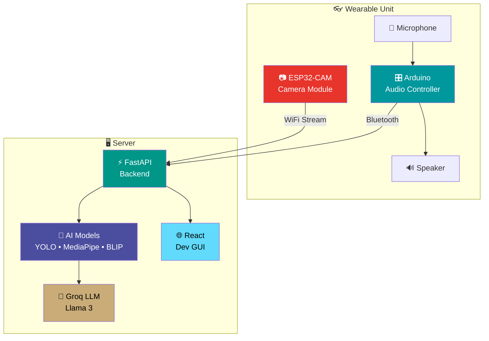
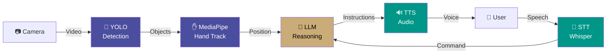
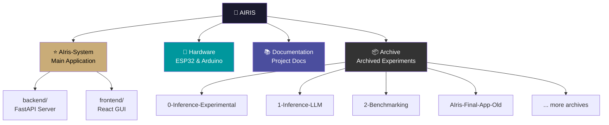

<div align="center">


---

**(pronounced: ai·ris | aɪ.rɪs)**

   

### AI-Powered Vision Assistant for the Visually Impaired
*"AI That Opens Eyes"*

[](https://python.org) [](https://fastapi.tiangolo.com) [](https://react.dev) [](https://espressif.com) [](LICENSE)

---

</div>

> [!NOTE]
> This project is under active development. The **core software is complete and tested**.
> Hardware integration (ESP32 + Arduino) is currently in progress.
>
> **Expected Completion: December 2025**

---

<div align="center">

## ✨ What is AIris?

</div>

**AIris** is a wearable AI assistant that helps visually impaired users **find objects** and **understand their surroundings** through real-time audio feedback. Unlike passive description tools, AIris provides **active guidance** — it doesn't just tell you what's there, it helps you reach it.

<div align="center">

### 🎯 Two Powerful Modes

</div>

<table>
<tr>
<td width="50%" align="center">

### **Active Guidance** ✅
*"Find my water bottle"*

Detects the object, tracks your hand, and guides you with audio until you touch it.

**Status: Working**

</td>
<td width="50%" align="center">

### **Scene Description** 🔄
*Continuous awareness*

Analyzes your environment and describes what's around you with safety alerts.

**Status: Testing**

</td>
</tr>
</table>

---

<div align="center">

## 🏗️ System Architecture

### Hardware Design



### Data Flow



</div>

---

<div align="center">

## 📊 Current Progress

</div>

| Component | Status | Progress |
|:----------|:------:|:--------:|
| 🎯 **Active Guidance Mode** | ✅ Complete |  |
| 🔍 **Scene Description Mode** | 🔄 Testing |  |
| ⚡ **Backend API** | ✅ Complete |  |
| 🌐 **Frontend GUI** | ✅ Complete |  |
| 📷 **ESP32-CAM Integration** | 🔄 In Progress |  |
| 🔊 **Arduino Audio** | 🔄 In Progress |  |
| 📦 **Physical Device** | ⏳ Pending |  |

<div align="center">

**Overall: ~70% Complete**

</div>

---

<div align="center">

## 🛠️ Technology Stack

</div>

<table>
<tr>
<td width="50%">

### 💻 Software

| Layer | Technology |
|:------|:-----------|
| **Backend** | FastAPI, Python 3.10+ |
| **Object Detection** | YOLOv8 (Ultralytics) |
| **Hand Tracking** | MediaPipe |
| **Scene Analysis** | BLIP |
| **LLM Reasoning** | Groq API (Llama 3) |
| **Speech-to-Text** | OpenAI Whisper |
| **Text-to-Speech** | pyttsx3 |
| **Frontend** | React, TypeScript, Vite |

</td>
<td width="50%">

### 🔌 Hardware

| Component | Technology |
|:----------|:-----------|
| **Camera** | ESP32-CAM (WiFi) |
| **Audio I/O** | Arduino + Bluetooth |
| **Microphone** | Electret/MEMS |
| **Speaker** | Mini 2W Speaker |
| **Controls** | Physical Buttons |
| **Processing** | Server/Computer |

</td>
</tr>
</table>

> **Note:** The React frontend is a development interface. The final device will be fully usable by blind users through **physical buttons and audio** alone — no screen required.

---

<div align="center">

## 📁 Repository Structure

</div>



<div align="center">

### 📂 Folder Guide

</div>

| Folder | Purpose | Status |
|:-------|:--------|:------:|
| **`AIris-System/`** | ⭐ **Main application** — Start here! Contains the working FastAPI backend and React frontend | Active |
| **`Hardware/`** | ESP32-CAM and Arduino firmware code | In Progress |
| **`Documentation/`** | PRD, plans, technical docs, images | Reference |
| **`Archive/`** | Archived experiments and prototypes from our development journey | Archive |

<details>
<summary><strong>📦 What's in Archive/?</strong></summary>

These folders document our development journey — experiments, prototypes, and iterations that led to the current implementation:

| Folder | What It Was |
|:-------|:------------|
| `0-Inference-Experimental` | Early BLIP experiments |
| `1-Inference-LLM` | First LLM integration tests |
| `2-Benchmarking` | Ollama/Raspberry Pi benchmarks |
| `3-Performance-Comparision` | Model comparison tests |
| `AIris-Core-System` | Previous core implementation |
| `AIris-Final-App-Old` | Previous app version |
| `Merged_System` | Integration experiments |
| `RSPB`, `RSPB-2` | Real-time system prototypes |

*Preserved for reference and academic documentation.*

</details>

---

<div align="center">

## 🚀 Quick Start

</div>

```bash
# Clone the repository
git clone https://github.com/rajin-khan/AIRIS.git
cd AIRIS/AIris-System

# Follow the setup guide
cat QUICKSTART.md
```

### Requirements
- Python 3.10+ and Node.js 18+
- Groq API Key (free at [console.groq.com](https://console.groq.com))
- Camera access (laptop webcam for testing)

📖 **Full setup:** [`AIris-System/README.md`](./AIris-System/README.md)

---

<div align="center">

## 📋 What's Left To Do

</div>

### 🔌 Hardware Integration *(Current Focus)*
- [ ] Complete ESP32-CAM WiFi streaming
- [ ] Finalize Arduino Bluetooth audio
- [ ] Wire physical button controls
- [ ] Design wearable enclosure (3D print)

### 🔧 Software Refinement
- [ ] Optimize Scene Description prompts
- [ ] Add guardian alert notifications
- [ ] Performance tuning for real-time streaming

### ✅ Testing & Validation
- [ ] End-to-end wireless testing
- [ ] Field testing with visually impaired users
- [ ] Battery life and reliability testing

---

<div align="center">

## 🌟 Key Features

| Feature | Description |
|:--------|:------------|
| 🎯 **Object Guidance** | Speak an object name → Get audio directions until you touch it |
| 🔍 **Scene Understanding** | Continuous environment awareness and description |
| ⚠️ **Safety Alerts** | Hazard detection with optional guardian notifications |
| 🎤 **Voice Control** | Speak commands, receive audio responses |
| 📡 **Wireless Design** | ESP32 WiFi camera + Bluetooth audio — no cables |
| 🔒 **Privacy First** | All AI processing happens on your local server |

---

## 📚 Documentation

| Document | Description |
|:---------|:------------|
| [**PRD.md**](./Documentation/PRD.md) | Product Requirements Document |
| [**Idea.md**](./Documentation/Idea.md) | Project vision and concept |
| [**Plan.md**](./Documentation/Plan.md) | Development roadmap |
| [**Structure.md**](./Documentation/Structure.md) | Detailed project structure |
| [**UseCases.md**](./Documentation/UseCases.md) | Core assistive scenarios |
| [**TechKnowledge.md**](./Documentation/Info/TechKnowledge.md) | Technology stack details |

---

## 👥 Development Team

This project is developed by:

| Name                      | Institution             | ID | GitHub | Followers |
|---------------------------|-------------------------|--  |--------|------|
| **Rajin Khan**            | North South University | 2212708042 | [](https://github.com/rajin-khan) |  |
| **Saumik Saha Kabbya**    | North South University | 2211204042 | [](https://github.com/Kabbya04) |  |

---

~ as part of CSE 499A/B at North South University, building upon the foundation of [TapSense](https://github.com/rajin-khan/TapSense) to advance accessibility technology.

---

</div>
