<div align="center">

# AIris 
**(pronounced: ai·ris | aɪ.rɪs)**

   

### Real-Time Scene Description System
*"AI That Opens Eyes"*

[](https://python.org) [](https://pytorch.org) [](https://raspberrypi.org) [](LICENSE)

---

</div>

> [!NOTE]
> This project is currently under active development by our team.
>
> **Expected Completion Date: December 2025.**

<div align="center">

## **Project Vision**

**AIris** is a revolutionary wearable AI system that provides instant, contextual scene descriptions for visually impaired users. With a simple button press, users receive intelligent, real-time descriptions of their surroundings through advanced computer vision and natural language processing.

### **Key Features**
- **Sub-2-second response time** from capture to audio description
- **Contextual intelligence** with spatial awareness and safety prioritization  
- **Offline-first design** with cloud enhancement capabilities
- **Wearable form factor** designed for comfort and accessibility
- **Private audio delivery** through integrated directional speakers

---

## **System Architecture**

### **Hardware Components**

```mermaid
graph TB
    A[👓 Spectacle Camera] --> B[🖥️ Raspberry Pi 5]
    B --> C[🔊 Directional Speaker]
    B --> D[🔋 Portable Battery]
    B --> E[📱 Optional Phone Sync]
    
    style A fill:#4B4E9E,color:#fff
    style B fill:#C9AC78,color:#000
    style C fill:#4B4E9E,color:#fff
```


### **Software Architecture**

```mermaid
graph LR
    A[📷 Camera Interface] --> B[🧠 AI Engine]
    B --> C[🔊 Audio System]
    
    subgraph "AI Engine"
        D[🎯 Scene Analyzer]
        E[☁️ Groq API Client]
        F[🏠 Local Models]
    end
    
    subgraph "Audio System"
        G[🗣️ TTS Engine]
        H[🎵 Speaker Control]
    end
    
    style A fill:#E9E9E6
    style B fill:#4B4E9E,color:#fff
    style C fill:#E9E9E6
```


---

## **Performance Targets**

| Metric | Target | Current Status |
|--------|---------|---------------|
| **Response Latency** | < 2.0s | ~ |
| **Object Recognition** | > 85% | ~ |
| **Battery Life** | > 8 hours | ~ |
| **Memory Usage** | < 7GB | ~ |

---

## **Current Development Status**

We're currently in the **prototype and testing phase**, working with a web interface to evaluate and optimize different multimodal AI models before hardware integration.

 


### **Web Interface Testing Platform**

Our development team is using a local web interface to rapidly prototype and test various AI models:

</div>

```
🌐 Development Web Interface
├── Image Upload & Capture Testi
├── Audio Output Testing
└── Real-time Metrics Visualization
```

<div align="center">

### 🧠 **Multimodal AI Model Evaluation**

We're currently testing and benchmarking multiple state-of-the-art vision-language models:

| Model | Status | Avg Response Time | Accuracy Score | Memory Usage |
|-------|---------|------------------|----------------|--------------|
| **LLaVA-v1.5** | ✅ Testing | ~ | ~ | ~ |
| **BLIP-2** | ✅ Testing | ~ | ~ | ~ |
| **MiniGPT-4** | ✅ Testing | ~ | ~ | ~ |
| **Groq API** | ✅ Testing | ~ | ~ | ~ |
| **Ollama Local** | ✅ Testing | ~ | ~ | ~ |

---

## **Development Workflow**

---

### **Current Phase: Model Optimization & Testing**

**Model Evaluation**
- Testing multiple vision-language models
- Benchmarking performance on Raspberry Pi 5
- Optimizing for speed vs. accuracy trade-offs

**Web Interface Development**
- Real-time model comparison dashboard
- Performance metrics visualization
- User experience prototyping

**Performance Optimization**
- Model quantization experiments
- Memory usage optimization
- Latency reduction techniques

### **Next Phase: Hardware Integration**

- Custom hardware design and 3D modeling
- Wearable form factor development
- Field testing with target users

---

## **Roadmap**

### **Phase 1: CSE 499A (Current)**
- ✅ Core software architecture
- ✅ AI model research and selection
- 🔄 Web interface development
- 🔄 Performance optimization
- ⏳ Audio system integration

### **Phase 2: CSE 499B (Upcoming)**
- ⏳ Hardware design and 3D modeling
- ⏳ Wearable system integration
- ⏳ Field testing with users
- ⏳ Final optimization and documentation

---

## **👥 Development Team:**
This project will be developed by:

| Name                      | Institution             | ID | GitHub | Followers |
|---------------------------|-------------------------|--  |--------|------|
| **Rajin Khan**            | North South University | 2212708042 | [](https://github.com/rajin-khan) |  |
| **Saumik Saha Kabbya**    | North South University | 2211204042 | [](https://github.com/Kabbya04) |  |

---

~ as part of CSE 499A/B at North South University, building upon the foundation of [TapSense](https://github.com/rajin-khan/TapSense) to advance accessibility technology.

---

</div>